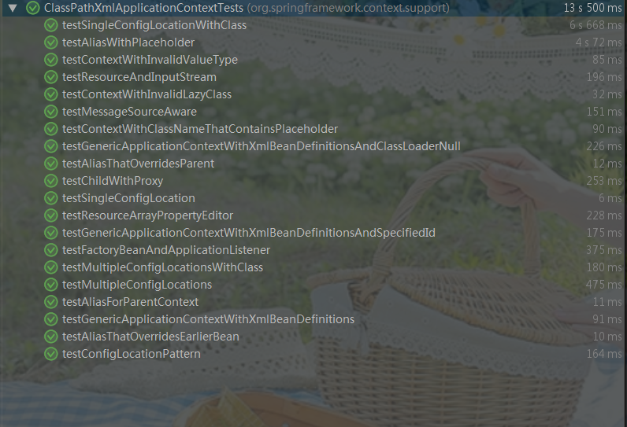

# 01-环境搭建

- 当前spring-framework版本为`version=5.1.0.BUILD-SNAPSHOT`。
- Spring官网：https://spring.io/

## 1、环境准备

环境要求：

- JDK1.8+
- maven3+（当前使用是apache-maven-3.5.4）
- gradle6+（当前使用的是gradle-6.3）
- IDE: 建议使用IDEA，目前Java使用最广泛的开发工具

环境安装：

​	需要自已通过百度来配置相关环境，我就不在这里细说了。需要注意的是spring-framework使用了gradle管理，所以需要配置好gradle和maven相关工作环境。

## 2、源码下载

网址：https://github.com/spring-projects/spring-framework/

> 建议fork到自己的github空间，方便源码分析过程中笔记记录，进行相关注释添加。

## 3、目录结构

> 正常下载然后导入IDEA，即可正常使用，问题不大。


## 4、简单调试

Spring的项目很多，并且有一个专门的`spring-test`模块。但是，每一个模块都有自己的测试案例。

大家都知道，spring 最常见的名词就是`Factory`,那么我们就以简单的Factory测试案例，来验证我们的环境是否有问题。

我们以`spring-context\src\test\java\org\springframework\beans\factory\xml\XmlBeanFactoryTests.java`模块测试为例，运行其中的测试方法

```java
@Test
public void testRefToSeparatePrototypeInstances() throws Exception {
   DefaultListableBeanFactory xbf = new DefaultListableBeanFactory();
   XmlBeanDefinitionReader reader = new XmlBeanDefinitionReader(xbf);
   reader.setValidationMode(XmlBeanDefinitionReader.VALIDATION_NONE);
   reader.loadBeanDefinitions(REFTYPES_CONTEXT);

   TestBean emma = (TestBean) xbf.getBean("emma");
   TestBean georgia = (TestBean) xbf.getBean("georgia");
   ITestBean emmasJenks = emma.getSpouse();
   ITestBean georgiasJenks = georgia.getSpouse();
   assertTrue("Emma and georgia think they have a different boyfriend", emmasJenks != georgiasJenks);
   assertTrue("Emmas jenks has right name", emmasJenks.getName().equals("Andrew"));
   assertTrue("Emmas doesn't equal new ref", emmasJenks != xbf.getBean("jenks"));
   assertTrue("Georgias jenks has right name", emmasJenks.getName().equals("Andrew"));
   assertTrue("They are object equal", emmasJenks.equals(georgiasJenks));
   assertTrue("They object equal direct ref", emmasJenks.equals(xbf.getBean("jenks")));
}
```

即可以看到如下结果：


表明测试案例运行是成功的，即事个环境搭建OK。

当然，我们可以找一个更有说服力的测试案例：

`spring-context\src\test\java\org\springframework\context\support\ClassPathXmlApplicationContextTests.java`。这个测试案例也是我们最常见的`ClassPathXmlApplicationContext`。可以使用此类，作为断点调试的入口。



