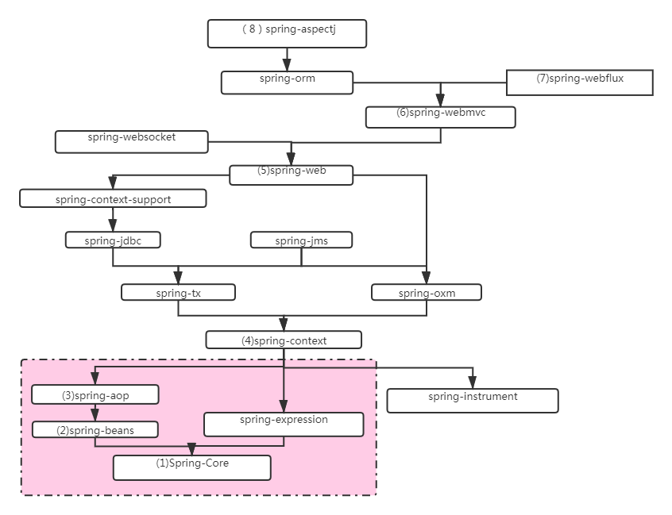

# 02-模块分析

# 2.1模块划分

上图是Spring官网(注意，最新版可能没有这个图，旧版有，此图来源于4.0.0.RELEASE版本)

总结一下就是上图的划分

- 核心容器-Core Container
  - Beans
  - Core
  - Context
    - Context-Support
  - Spel
- AOP模块
  - AOP
  - Aspects模块
  - instrument
- 数据库访问与集成
  - spring-jdbc
  - spring-orm
  - spring-tx
- WEB编程
  - spring-web
  - spirng-webflux
  - spring-webmvc
  - spring-websocket
- 消息模块
  - messaging
  - jms
- 日志模块-jcl
- 其它
  - 
  - oxm
  - indexer
- 

# 2.2核心容器（Core Containe）

​		核心容器提供了Spring框架的基本功能，是其它模块建立的基础，有 `spring-core`、`spring-beans`、`spring-context`、`spring-context-support`和`spring-expression`（Expression Language、SpEL）组成。`spring-beans`和`spring-core`是spring框架的核心模块。

## spring-core

提供了框架的基本组成部分，包括`控制翻转(Inversion of Control, IOC)`和`依赖注入(Dependency Injection, DI)`功能。

## spring-beans

提供了`BeanFactory`，`BeanFactory`接口是`spring`框架中的核心接口，它是`工厂模式`的经典实现。`BeanFactory`使用`控制翻转`对应用程序的配置和依赖性规范与实际的应用程序代码进行了分离。但`BeanFactory`容器实例化后并不会自动创建实例化`Bean`，只有当`Bean`被使用的时候`BeanFactory`容器才会对该`Bean`进行实例化与依赖关系的装配。

## spring-context

`spring-context`模块构架与`spring-core`和`spring-beans`模块之上，提供了一个框架式的对象访问方式，是访问定义和配置的任意对象的媒介。它扩展了`BeanFactory`，为其增加了`Bean`生命周期控制、框架事件体系以及资源加载透明化等功能。

`ApplicationContext`是该模块的核心接口，它是`BeanFactory`的子类，与`BeanFactory`不同的是`ApplicationContext`容器实例化后会自动对所有的单实例`Bean`进行实例化与依赖关系的装配，使之处于待用状态。

## spring-context-support

用于将常见的第三方库集成到`spring`应用程序上下文中。该模块提供了高速缓存、任务调度、邮件访问、freemarker模板等支持。

## spring-expression

该模块是对`JSP2.1`规范中规定的统一表达式语言`EL`的扩展模块，它提供了强大的表达式语言去支持运行时查询和操作运行中的对象，该语言支持设置和获取属性值、属性分配、方法调用、访问数组、集合和索引器的内容、逻辑和算术运算、变量命名以及从Spring的IOC容器中以名称检索对象。它还支持列表投影、选择以及常用的列表聚合。

它的语法类似于传统的`EL`，但提供了额外的功能。最出色的要数函数调用和简单字符串的模板函数。这种语言的特性是基于 `spring` 产品的需求而设计， 他可以非常方便地同 `spring IOC` 进行交互。

# 2.3AOP 和设备支持（AOP）

由`spring-aop`、`spring-aspects`和 `spring-instrument` 3个模块组成。

## spring-aop

`spring-aop` 是spring的另一个核心模块，提供了一个符合AOP要求的面相切面的编程实现。作为继`OOP`之后，对程序员影响最大的编程思想之一，`AOP`极大的开拓了人们对于编程的思路。

在`spring`中，以`JDK动态代理`的技术为基础，设计出了一系列的`AOP`横切实现，比如：`前置通知`、`返回通知`和`异常通知`等。同时使用 `Pointcut` 接口匹配切入点，可以使用现有的切入点设计横切面；也可以扩展相关方法根据需求进行切入，将代码按照功能进行分离，以便干净的解耦。

## spring-aspects

提供了与`AspectJ`的集成功能，主要是为`AOP`提供了多种实现方法。

## spring-instrument

该模块是`spring-aop`的一个支援模块，提供了类植入(Instrumentation)支持和类加载器的实现。主要作用于JVM启动时，生成一个代理类，程序员通过代理类在运行时修改类的字节，从而改变一个类的功能，实现`AOP`的功能。

# 2.4数据访问与集成（Data Access/Integration）

由`spring-jdbc`、`spring-orm`、`spring-oxm`、`spring-jms`和`spring-tx`组成。

## spring-jdbc

`spring-jdbc`模块是`spring`提供的`JDBC`抽象层，消除了繁琐的编码以及数据库厂商特有的错误代码解析。用于简化`JDBC`，主要提供`JDBC`的模板方法、关系数据库对象化方式、事务管理来简化`JDBC`编程，主要实现类有`JdbcTemplate`、`SimpleJdbcTemplate`以及`NamedParameterJdbcTemplate`。

## spring-orm

`spring-orm`模块是`ORM`的支持模块，主要集成`Hibernate`、`Java Persistence API(JPA)`和`Java Data Object(JDO)`用于资源管理、数据访问对象（DAO）的实现和事务策略。

## spring-oxm

`spring-oxm`模块主要提供一个抽象层支撑OXM(Object-to-XML-Mapping)，例如：`JAXB`、`Castor`、`XMLBeans`、`JiBX`和`XStream`等。

## spring-jms

`spring-jms`模块（Java Message Service）为Java消息传递服务，能够发送和接收信息，自Spring Framework 4.1 以后，它还提供了对`spring-messaging`模块的继承。

## spring-tx

`spring-tx`模块是`spring-jdbc`事务控制实现模块，支持用于实现所有接口和所有`POJO`(普通Java对象)类的编程和声明式事务的管理。

# 2.5Web

由`spring-websocket`、`spring-webmvc`、`spring-web`和`spring-webflux`组成

## spring-web

`spring-web`模块为`spring`提供了最基础的`web`支持，主要建立在核心容器之上，通过`Servlet`或者`Listeners`来初始化IOC容器以及Web应用上下文，自动装载`WebApplicationContext`，也包含一些与`web`相关的支持，如：`Struts`集成类、文件上传支持的类、`FIlter`类和大量辅助工具类。

## spring-webmvc

也称`web-servlet`模块，包含用于`Web`应用程序的`Spring MVC`和`REST Web Service`实现。Spring MVC框架提供了领域模型代码和`Web`表单之间的清晰分离，并与`Spring Framework`的所有其他功能集成。

## spring-websocket

`Spring4.0`以后新增的模块，实现双工异步通讯协议，实现了`WebSocket`和`SocketJS`，提供`Socket`通信和`Web`端的推送功能。

## spring-webflux

是一个新的非堵塞函数式`Reactive Web`框架，可以用来建立异步的，非阻塞，事件驱动的服务，并且扩展性非常好。

# 2.6消息（Messaging）

## spring-messaging

`spring-messaging`是从 `Spring4.0` 开始新加入的一个模块，主要职责是为 `Spring` 框架集成一些基础的报文传送应用。

# 2.7Test

## spring-test

`spring-test`模块主要为测试提供支持的，毕竟在不需要发布（程序）到你的应用服务器或者连接到其他企业设施的情况下能够执行一些集成测试或者其他测试对于任何企业都是非常重要的。

# 2.8模块间依赖关系 

