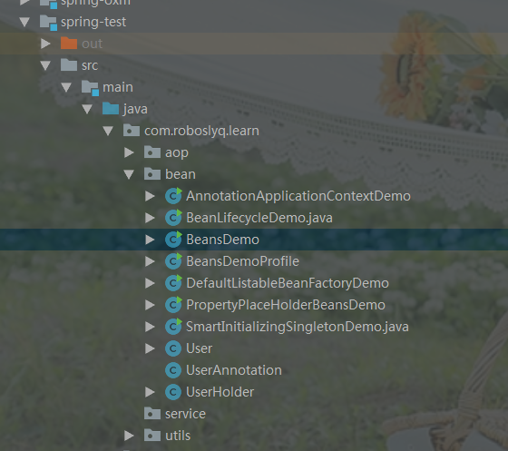
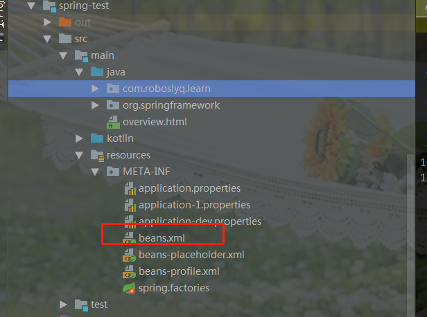
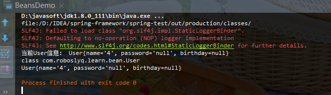
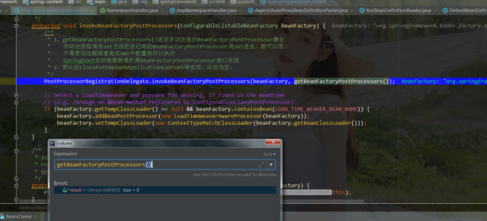

# 03-Spring启动流程分析

> 以XMl配置为示例，如果是注解，原理类似。

# 1. 环境准备

> 我是基于spring-test模块自已建立新的测试包和类，方便学习调试。
>
> 

## 1.1 准备Bean

```java
package com.roboslyq.learn.bean;
import org.springframework.beans.factory.InitializingBean;
import javax.annotation.PostConstruct;
import java.util.Date;
/**
 * @author roboslyq
 * @date 2021/11/6
 * @since 1.0.0
 */
public class User implements InitializingBean {
	private String name;
	private String password;
	public Date getBirthday() {
		return birthday;
	}
	public void setBirthday(Date birthday) {
		this.birthday = birthday;
	}
	private Date birthday;
	public String getName() {
		return name;
	}
	public void setName(String name) {
		this.name = name;
	}
	public String getPassword() {
		return password;
	}
	public void setPassword(String password) {
		this.password = password;
	}
	@Override
	public String toString() {
		return "User{" +
				"name='" + name + '\'' +
				", password='" + password + '\'' +
				", birthday=" + birthday +
				'}';
	}

	@PostConstruct
	public void post(){
		this.setName("6");
		P.print(this);
	}
	public void init(){
		this.setName("5");
		P.print(this);
	}
	@Override
	public void afterPropertiesSet() throws Exception {
		this.setName("4");
		P.print(this);
	}
}

```

> @PostConstruct ,init()和afterPropertiesSet() 是和Bean的生命周期相关的。

## 1.2 准备xml配置

> xml保存到spring-framework\spring-test\src\main\resources\META-INF\beans.xml



```xml
<?xml version="1.0" encoding="UTF-8"?>
<beans xmlns="http://www.springframework.org/schema/beans"
	   xmlns:xsi="http://www.w3.org/2001/XMLSchema-instance"
	   xsi:schemaLocation="http://www.springframework.org/schema/beans 
                           http://www.springframework.org/schema/beans/spring-beans-3.1.xsd">
	<bean id="user" class="com.roboslyq.learn.bean.User">
		<property name="name" value="${name}"/>
	</bean>
</beans>
```

## 1.3准备启动类

```java
package com.roboslyq.learn.bean;

import org.springframework.context.support.ClassPathXmlApplicationContext;
/**
 * @author roboslyq
 * @date 2021/11/6
 * @since 1.0.0
 */
public class BeansDemo {
	public static void main(String[] args) {
		System.out.println(BeansDemo.class.getResource("/"));
		ClassPathXmlApplicationContext context = new ClassPathXmlApplicationContext("classpath:/META-INF/beans.xml");
		User user = context.getBean("user",User.class);
		System.out.println(user.getClass());
		System.out.println(user);
	}
}
```

## 1.4 调试打印结果




# 2. 启动入口

```java
public class ClassPathXmlApplicationContext extends AbstractXmlApplicationContext {
	/** 省略N多其它信息，仅保留两个构造函数**/
    public ClassPathXmlApplicationContext() {
    }
    /**
	 * Create a new ClassPathXmlApplicationContext for bean-style configuration.
	 * @param parent the parent context
	 * @see #setConfigLocation
	 * @see #setConfigLocations
	 * @see #afterPropertiesSet()
	 * roboslyq --> 传入parent Context。从而可以说明，Context支持父子关系，即父容器和子容器。
	 */
	public ClassPathXmlApplicationContext(ApplicationContext parent) {
		super(parent);
	}
    public ClassPathXmlApplicationContext(String configLocation) throws BeansException {
        // 指下面的构造函数，会启动容器
        this(new String[] {configLocation}, true, null);
    }
    
    public ClassPathXmlApplicationContext(
			String[] configLocations, boolean refresh, @Nullable ApplicationContext parent)
			throws BeansException {
		/*
		 * roboslyq--使用new方法创建PathMatchingResourcePatternResolver，可以用来解析资源文件，主要是用来解析类路径下的资源文件。
		 * 当然它也可以用来解析其它资源文件，如基于文件系统的本地资源文件。
		 * 使用方式为PathMatchingResourcePatternResolver.getResource("file:pom.xml");
		 */
		super(parent);
		/*
		 * roboslyq-->
		 *   (1)设置父类AbstractRefreshableApplicationContext资源位置，后续解析时会使用此值
		 * 	 (2)将String形式的资源转换为String数组
		 * 	 (3) 会调用Enviroment中的resolveRequiredPlaceholders方法，解析传入的路径中的占位符（即将占位符替换为具体的值）
		 * 		getEnvironment().resolveRequiredPlaceholders(path)
		 */
		setConfigLocations(configLocations);
		if (refresh) {
			/**
			 *roboslyq-->启动容器,不带参数
			 */
			refresh();
		}
	}
}
```

- 无参构造函数是一个空实现，因此不会自动启动容器。需要手动调用`refresh()`方法来启动容器。
- 有参构造函数会默认调用refresh访方法。
- 构造函数可以传入一个已经存在的Context作为父容器，因此，Context可以构造成父子容器关系。这在SpringBoot和Spring Cloud中使用十分广泛。 ClassPathXmlApplicationContext(ApplicationContext parent)

# 3. AbstractApplicationContext#Refresh()分析

```java
/**
	 * roboslyq -- > 应用上下文Context启动(刷新)
	 * 1、refresh()这个方法名称不能完全涵盖它所有的功能，所以有一点点不太合理
	 * 2、主要描述的是BeanFactory的生命周期
	 * @throws BeansException
	 * @throws IllegalStateException
	 */
	@Override
	public void refresh() throws BeansException, IllegalStateException {
		// 加锁，防止多次重复启动，因此Spring 框架不知道我们是在什么样的环境下使用，也不知道我们会怎么去启动它。所以需要加锁，所以在任何环境下只启动一次。
		synchronized (this.startupShutdownMonitor) {
			// Prepare this context for refreshing.
			// 阶段一：准备阶段-应用上下文Context刷新前准备
			prepareRefresh();

			// Tell the subclass to refresh the internal bean factory.
			// 阶段二：BeanFactory创建阶段(完成两个主要功能：创建DefaultListableBeanFactory实例和将配置解析为BeanDefinition)
			ConfigurableListableBeanFactory beanFactory = obtainFreshBeanFactory();

			// Prepare the bean factory for use in this context.
			//阶段三：BeanFactory准备阶段(设置BeanFacotry的一些相关属性)
			 prepareBeanFactory(beanFactory);

			try {
				// Allows post-processing of the bean factory in context subclasses.
				/* 阶段四：BeanFactory后置处理阶段
				 *	(1)模板抽象方法(继承的方式),当前未做处理可以自定义扩展。子类通过重写这个方法来在BeanFactory创建并预准备完成以后做进一步的设置
				 *	(2)在第二步完成Bean容器(BeanFactory)初始化后，此时BeanFactory均是默认参数。此入口提供目的是BeanDefinition装载后，可以再次修改BeanFactory的一些属性。
				 */
				postProcessBeanFactory(beanFactory);

				// Invoke factory processors registered as beans in the context.
				// 阶段五：调用BeanFactory的后置处理器BeanFactoryPostPorcessor
				invokeBeanFactoryPostProcessors(beanFactory);

				// Register bean processors that intercept bean creation.
				// 阶段六：注册bean后置处理器BeanPostProcessor(其实BeanPostProcessor能力有前有后，因此命名不太规范^_^)
				// 以便有能力拦截bean的创建行为(十分重要的扩展，很多功能是基于此实现例如AOP等)
				registerBeanPostProcessors(beanFactory);

				// Initialize message source for this context.
				// 阶段七(1)：初始化内建Bean-MessageSource（国际化资源处理）；
				initMessageSource();

				// Initialize event multicaster for this context.
				// 阶段七(2):初始化内建Bean-初始化事件广播器
				initApplicationEventMulticaster();

				// Initialize other special beans in specific context subclasses.
				//阶段八：应用上下文刷新阶段-特定的上下文中初始化特别的beans,默认空实现。由子类自己实现重写，在容器刷新的时候可以自定义逻辑；
				onRefresh();

				// Check for listener beans and register them.
				//阶段九：注册事件监听器（给容器中将所有项目里面的ApplicationListener注册进来）
				registerListeners();

				// Instantiate all remaining (non-lazy-init) singletons.
				//阶段十：BeanFactory初始化完成
				finishBeanFactoryInitialization(beanFactory);

				// Last step: publish corresponding event.
				//阶段十一：上下文Context结束启动,表明已经完成BeanFactory的初始化创建工作及IOC容器就创建；
				finishRefresh();
			}

			catch (BeansException ex) {
				if (logger.isWarnEnabled()) {
					logger.warn("Exception encountered during context initialization - " +
							"cancelling refresh attempt: " + ex);
				}

				// Destroy already created singletons to avoid dangling resources.
				destroyBeans();

				// Reset 'active' flag.
				cancelRefresh(ex);

				// Propagate exception to caller.
				throw ex;
			}

			finally {
				// Reset common introspection caches in Spring's core, since we
				// might not ever need metadata for singleton beans anymore...
				// 清除Bean创建过程中的缓存信息，因为Bean创建完成后不再需要这个缓存信息
				resetCommonCaches();
			}
		}
	}
```

## 3.0 启动阶段概览

此启动可以分为比较关键的几个阶段：

- 1、**prepareRefresh()**：应用上下文启动准备阶段
  - 初始化Enviroment
  - 初始化PropertySource配置

- 2、BeanFactory相关阶段
  - **obtainFreshBeanFactory()**：获取BeanFactory实例
    - 此时BeanFactory仅创建实例，还未实现属性初始化

  - **prepareBeanFactory(beanFactory)**：BeanFactory准备阶段
    - 关联 ClassLoader
    - 设置 Bean 表达式处理器：SPEL
    -  添加 PropertyEditorRegistrar 实现 - ResourceEditorRegistrar
    - 添加 Aware 回调接口 BeanPostProcessor 实现 - ApplicationContextAwareProcessor
    -  忽略 Aware 回调接口作为依赖注入接口
    -  注册 ResolvableDependency 对象 - BeanFactory、ResourceLoader、ApplicationEventPublisher 以及
    - ApplicationContext
      - 注册 ApplicationListenerDetector 对象
      - 注册 LoadTimeWeaverAwareProcessor 对象
      - 注册单例对象 - Environment、Java System Properties 以及 OS 环境变量

  - BeanFactory后置处理阶段
    - postProcessBeanFactory(beanFactory);
      - 通过继承方式扩展处理，平时少用。

    - AbstractApplicationContext#invokeBeanFactoryPostProcessors(ConfigurableListableBeanFactor
      y 方法
      -  调用 BeanFactoryPostProcessor 或 BeanDefinitionRegistry 后置处理方法
      - 注册 LoadTimeWeaverAwareProcessor 对象

- 3、注册BeanPostProcessor：registerBeanPostProcessors(beanFactory);
  - 注册 PriorityOrdered 类型的 BeanPostProcessor Beans
  -  注册 Ordered 类型的 BeanPostProcessor Beans
  - 注册普通 BeanPostProcessor Beans
  - 注册 MergedBeanDefinitionPostProcessor Beans
  - 注册 ApplicationListenerDetector 对象

- 4、初始化內建 Bean：
  - 国际化处理：initMessageSource();
  - 初始化事件广播器：initApplicationEventMulticaster();

- 5、Spring 应用上下文刷新阶段：onRefresh();
  - 特定的上下文中初始化特别的beans,默认空实现。由子类自己实现重写，在容器刷新的时候可以自定义逻辑：
  - 子类覆盖该方法
    • org.springframework.web.context.support.AbstractRefreshableWebApplicationContext#onRefresh()
    • org.springframework.web.context.support.GenericWebApplicationContext#onRefresh()
    • org.springframework.boot.web.reactive.context.ReactiveWebServerApplicationContext#onRefresh(
    )
    • org.springframework.boot.web.servlet.context.ServletWebServerApplicationContext#onRefresh()
    • org.springframework.web.context.support.StaticWebApplicationContext#onRefresh()

- 6、注册事件监听器：registerListeners();
  - 添加当前应用上下文所关联的 ApplicationListener 对象（集合）
  - 添加 BeanFactory 所注册 ApplicationListener Beans
  - 广播早期 Spring 事件

- 7、BeanFactory初始化结束：finishBeanFactoryInitialization(beanFactory);
- 8、上下文Context初始化结束：finishRefresh();

## 3.1 应用上下文启动准备阶段

> prepareRefresh()

```java
/**
	 * Prepare this context for refreshing, setting its startup date and
	 * active flag as well as performing any initialization of property sources.
	 * 容器启动前的准备阶段，设置启动日期和启动标识并且完成property资源初始化
	 */
	protected void prepareRefresh() {
		//准备工作1：设置容器的启动时间戳
		this.startupDate = System.currentTimeMillis();
		//准备工作2： 设置容器关闭状态=false,启动状态=true。即容器为激活状态
		this.closed.set(false);
		this.active.set(true);

		// Initialize any placeholder property sources in the context environment
		// 准备工作3：执行任何属性源初始化initPropertySources,默认空实现，一个扩展点。如果需要实现，一般是对Enviroment相关的配置
		// 例如常见实现有Web应用相关的AbstractRefreshableWebApplicationContext等Context对自身的Servlet相关资源进行初始化
		initPropertySources();

		// Validate that all properties marked as required are resolvable
		// see ConfigurablePropertyResolver#setRequiredProperties
		//验证是否系统环境中有RequiredProperties参数值,默认空实现，一个扩展点
		//准备工作4：此处会getEnvironment,如果没有初始化，则新初始化一个。如果已经初始化则直接获取。通常WebContext已经在上面的initPropertySources()方法完成初始化。
		getEnvironment().validateRequiredProperties();

		// Allow for the collection of early ApplicationEvents,
		// to be published once the multicaster is available...
		this.earlyApplicationEvents = new LinkedHashSet<>();
	}

	protected void initPropertySources() {
		// For subclasses: do nothing by default.
	}
```

### 3.1.1初化化资源：initPropertySources()

此处是一个扩展实现，在和Web相关的ApplicationContext中，可以在此处初始化好Enviroment，并且加载servlet等相关配置。使之servlet与spring相关结合。

就ClassPathXmlApplicationContext而言，此处是一个空实现。

### 3.1.2创建Enviroment

> getEnvironment().validateRequiredProperties();

```java
	@Override
	public ConfigurableEnvironment getEnvironment() {
		if (this.environment == null) {
			this.environment = createEnvironment();
		}
		return this.environment;
	}
	protected ConfigurableEnvironment createEnvironment() {
		return new StandardEnvironment();
	}
```

最终得到的是一个标准的StandardEnvironment();

## 3.2BeanFactory创建阶段

> obtainFreshBeanFactory();

### 3.2.1创建BeanFactory

- spring-context\src\main\java\org\springframework\context\support\AbstractApplicationContext.java

```java
	protected ConfigurableListableBeanFactory obtainFreshBeanFactory() {
		/*
		 * roboslyq-刷新Bean工厂。在子类AbstractRefreshableApplicationContext类中有具体实现
		 * 此时，已经实现了BeanDefinition的装载。
		 * 十分重要的入口！！！
		 */
		refreshBeanFactory();
		/*
		 * roboslyq-获取Bean工厂,在子类AbstractRefreshableApplicationContext类中有具体实现。
		 */
		ConfigurableListableBeanFactory beanFactory = getBeanFactory();
		if (logger.isDebugEnabled()) {
			logger.debug("Bean factory for " + getDisplayName() + ": " + beanFactory);
		}
		return beanFactory;
	}
```

- spring-context\src\main\java\org\springframework\context\support\AbstractRefreshableApplicationContext.java

```java
/**
	 * This implementation performs an actual refresh of this context's underlying
	 * bean factory, shutting down the previous bean factory (if any) and
	 * initializing a fresh bean factory for the next phase of the context's lifecycle.
	 * roboslyq--容器启动时刷新工厂。如果已经存在则先销毁关闭，然后重新创建新工厂。并且实现BeanDefinition的装载
	 */
	@Override
	protected final void refreshBeanFactory() throws BeansException {
		/*
		 * roboslyq-->Bean工厂是否存在。正常一般情况为false
		 */
		if (hasBeanFactory()) {
			destroyBeans();//如果已经存在BeanFactory，则先销毁Bean实例
			closeBeanFactory();//关闭BeanFactory
		}
		try {
			//roboslyq-->创建Bean工厂,直接new 一个 DefaultListableBeanFactory类进行干活
			//spring注册及加载bean就靠它。其实这里还是一个基本的容器
			DefaultListableBeanFactory beanFactory = createBeanFactory();
			//设置Bean工厂序列化ID
			beanFactory.setSerializationId(getId());
			//可对Bean工厂进行定制，一个扩展点
			customizeBeanFactory(beanFactory);
			/*
			 * 	roboslyq-->初始化XmlBeanDefinitionReader用来读取xml，并加载解析。装载BeanDefinition核心入口。
			 * 	在AbstractXmlApplicationContext中有具体实现
			 */
			loadBeanDefinitions(beanFactory);
			//设置为全局变量，关联新建BeanFactory到Spring应用上下文AbstractRefreshableApplicationContext持有DefaultListableBeanFactory引用
			synchronized (this.beanFactoryMonitor) {
				this.beanFactory = beanFactory;
			}
		}
		catch (IOException ex) {
			throw new ApplicationContextException("I/O error parsing bean definition source for " + getDisplayName(), ex);
		}
	}

	protected DefaultListableBeanFactory createBeanFactory() {
		return new DefaultListableBeanFactory(getInternalParentBeanFactory());
	}

```

从而可知，最终返回的是 createBeanFactory()中创建的 `DefaultListableBeanFactory`,这也是Spring框架中真正干活最多的Factory。

> 在层层的构造器中，可能会初始相关工具的实例，比在spring-context\src\main\java\org\springframework\context\support\AbstractApplicationContext.java`完成了资源加载器创建。
>
> ```java
> /**
> 	 * Create a new AbstractApplicationContext with no parent.
> 	 */
> 	public AbstractApplicationContext() {
> 		this.resourcePatternResolver = getResourcePatternResolver();
> 	}
> 
> 	/**
> 	 * Create a new AbstractApplicationContext with the given parent context.
> 	 * @param parent the parent context
> 	 */
> 	public AbstractApplicationContext(@Nullable ApplicationContext parent) {
> 		// this()会初始化资源解析器为PathMatchingResourcePatternResolver
> 		this();
> 		setParent(parent);
> 	}
> protected ResourcePatternResolver getResourcePatternResolver() {
> 		return new PathMatchingResourcePatternResolver(this);
> 	}
> ```
>
> 

### 3.2.2设置BeanFactory一些属性

- spring-context\src\main\java\org\springframework\context\support\AbstractRefreshableApplicationContext.java

```java
	protected void customizeBeanFactory(DefaultListableBeanFactory beanFactory) {
		// 设置容器是否允许Bean重复定义
		if (this.allowBeanDefinitionOverriding != null) {
			beanFactory.setAllowBeanDefinitionOverriding(this.allowBeanDefinitionOverriding);
		}
		// 是否允许循环依赖
		if (this.allowCircularReferences != null) {
			beanFactory.setAllowCircularReferences(this.allowCircularReferences);
		}
	}
```

- 配置是否允许Bean重复定义，默认是True,在DefaultListableBeanFactory中定义。

  ```java
  
  	/** Whether to allow re-registration of a different definition with the same name. */
  	/** 是否允许重复注册(即Bean名字重复时，后加载的Bean覆盖前面加载的Bean)*/
  	private boolean allowBeanDefinitionOverriding = true;
  ```

- 配置BeanFactory是否允许循环依赖，默认为True。

### 3.2.3加载BeanDefinition

> 将XMl解析为BeanDefinition，并且注册到BeanFactory中

```java
/**
	 * Loads the bean definitions via an XmlBeanDefinitionReader.
	 * @see org.springframework.beans.factory.xml.XmlBeanDefinitionReader
	 * @see #initBeanDefinitionReader
	 * @see #loadBeanDefinitions
	 * roboslyq-->Bean定位及加载
	 */
	@Override
	protected void loadBeanDefinitions(DefaultListableBeanFactory beanFactory) throws BeansException, IOException {
		// Create a new XmlBeanDefinitionReader for the given BeanFactory.
		/**
		 * roboslyq-->获取Reader相关实例，读取相关的配置文件
		 * 直接new一个XmlBeanDefinitionReader,入参为BeanFactory
		 */
		XmlBeanDefinitionReader beanDefinitionReader = new XmlBeanDefinitionReader(beanFactory);

		// Configure the bean definition reader with this context's
		// resource loading environment.
		beanDefinitionReader.setEnvironment(this.getEnvironment());
		//roboslyq -->如果使用ClassPathXmlApplicationContext,则ResourceLoader = ClassPathXmlApplicationContext
		beanDefinitionReader.setResourceLoader(this);
		beanDefinitionReader.setEntityResolver(new ResourceEntityResolver(this));

		// Allow a subclass to provide custom initialization of the reader,
		// then proceed with actually loading the bean definitions.
		//一个扩展点，允许子类提供关于reader初始化相关功能。
		initBeanDefinitionReader(beanDefinitionReader);
		/**
		 * roboslyq-->加载Bean定义（核心流程）
		 */
		loadBeanDefinitions(beanDefinitionReader);
	}
```

#### 3.2.4.1 创建及配置XmlBeanDefinitionReader

#### 3.2.4.2解析Bean

> loadBeanDefinitions(beanDefinitionReader);

- spring-context\src\main\java\org\springframework\context\support\AbstractXmlApplicationContext.java

```java
protected void loadBeanDefinitions(XmlBeanDefinitionReader reader) throws BeansException, IOException {
		
		Resource[] configResources = getConfigResources();
		if (configResources != null) {
			reader.loadBeanDefinitions(configResources);
		}
		/**
		 * 获取BeanFactory构造函数传入的资源配置信息
		 * roboslyq-->此resources在入口处通过setConfigLocations(configLocations);来初始化
		 *
		 */
		String[] configLocations = getConfigLocations();
		if (configLocations != null) {
			/**
			 * Bean加载核心流程入口
			 */
			reader.loadBeanDefinitions(configLocations);
		}
	}
```

- spring-beans\src\main\java\org\springframework\beans\factory\support\AbstractBeanDefinitionReader.java

```java
@Override
	public int loadBeanDefinitions(String... locations) throws BeanDefinitionStoreException {
		Assert.notNull(locations, "Location array must not be null");
		int counter = 0;
		/**
		 * 循环加载资源配置文件（按路径来循环，一个路径下可以有很多个配置文件）
		 */
		for (String location : locations) {
			counter += loadBeanDefinitions(location);
		}
		return counter;
	}

	@Override
	public int loadBeanDefinitions(String location) throws BeanDefinitionStoreException {
		return loadBeanDefinitions(location, null);
	}

public int loadBeanDefinitions(String location, @Nullable Set<Resource> actualResources) throws BeanDefinitionStoreException {
		/**
		 * roboslyq-->resourceLoader = org.springframework.context.support.ClassPathXmlApplicationContext
		 */
		ResourceLoader resourceLoader = getResourceLoader();
		if (resourceLoader == null) {
			throw new BeanDefinitionStoreException(
					"Cannot import bean definitions from location [" + location + "]: no ResourceLoader available");
		}
		//正常Bean加载会进入此处，判断加载资源的数量
		if (resourceLoader instanceof ResourcePatternResolver) {
			// Resource pattern matching available.
			try {
				//roboslyq-->获取一个路径下所有的资源文件
				/**
				 *	ClassPathXmlApplicationContext中初始化 ResourcePatternResolver = PathMatchingResourcePatternResolver
				 *  将String转换为Resources
 				 */
				Resource[] resources = ((ResourcePatternResolver) resourceLoader).getResources(location);
				/**
				 * roboslyq-->加载一个路径下的所有资源，返回已经加载Bean的个数。
				 * 核心流程
				 */
				int loadCount = loadBeanDefinitions(resources);
				if (actualResources != null) {
					for (Resource resource : resources) {
						actualResources.add(resource);
					}
				}
				if (logger.isDebugEnabled()) {
					logger.debug("Loaded " + loadCount + " bean definitions from location pattern [" + location + "]");
				}
				return loadCount;
			}
			catch (IOException ex) {
				throw new BeanDefinitionStoreException(
						"Could not resolve bean definition resource pattern [" + location + "]", ex);
			}
		}
		else {
			// Can only load single resources by absolute URL.
			Resource resource = resourceLoader.getResource(location);
			int loadCount = loadBeanDefinitions(resource);
			if (actualResources != null) {
				actualResources.add(resource);
			}
			if (logger.isDebugEnabled()) {
				logger.debug("Loaded " + loadCount + " bean definitions from location [" + location + "]");
			}
			return loadCount;
		}
	}

```

- ResourceLoader resourceLoader = getResourceLoader();得到的ResourceLoader是ClassPathXmllApplicationContext。因此，BeanFactory本身就是一个ResourceLoader。

##### 将配置文件加载为Resource

>  PathMatchingResourcePatternResolver.java

> spring-core\src\main\java\org\springframework\core\io\support\PathMatchingResourcePatternResolver，加载资源。将对应的配置文件加载为`Resource`抽象。

```java
@Override
	public Resource[] getResources(String locationPattern) throws IOException {
		Assert.notNull(locationPattern, "Location pattern must not be null");
		/**
		 * roboslyq 解析classpath下的资源
		 *
		 *  */
		if (locationPattern.startsWith(CLASSPATH_ALL_URL_PREFIX)) {
			// a class path resource (multiple resources for same name possible)
			if (getPathMatcher().isPattern(locationPattern.substring(CLASSPATH_ALL_URL_PREFIX.length()))) {
				// a class path resource pattern
				return findPathMatchingResources(locationPattern);
			}
			else {
				// all class path resources with the given name
				return findAllClassPathResources(locationPattern.substring(CLASSPATH_ALL_URL_PREFIX.length()));
			}
		}
		else {
			// Generally only look for a pattern after a prefix here,
			// and on Tomcat only after the "*/" separator for its "war:" protocol.
			int prefixEnd = (locationPattern.startsWith("war:") ? locationPattern.indexOf("*/") + 1 :
					locationPattern.indexOf(':') + 1);
			if (getPathMatcher().isPattern(locationPattern.substring(prefixEnd))) {
				// a file pattern
				return findPathMatchingResources(locationPattern);
			}
			else {
				// a single resource with the given name
				return new Resource[] {getResourceLoader().getResource(locationPattern)};
			}
		}
	}
```

##### 解析Resource文件 

> loadBeanDefinitions(resources);

```java
@Override
	public int loadBeanDefinitions(Resource... resources) throws BeanDefinitionStoreException {
		Assert.notNull(resources, "Resource array must not be null");
		int counter = 0;
		/**
		 * roboslyq-->循环加载所有配置的文件中的Bean配置,resources为资源文件抽象
		 */
		for (Resource resource : resources) {
			/**
			 * XmlBeanDefinitionReader中实现
			 */
			counter += loadBeanDefinitions(resource);
		}
		return counter;
	}
@Override
	public int loadBeanDefinitions(Resource resource) throws BeanDefinitionStoreException {
		return loadBeanDefinitions(new EncodedResource(resource));
	}

public int loadBeanDefinitions(EncodedResource encodedResource) throws BeanDefinitionStoreException {
		Assert.notNull(encodedResource, "EncodedResource must not be null");
		if (logger.isInfoEnabled()) {
			logger.info("Loading XML bean definitions from " + encodedResource.getResource());
		}

		Set<EncodedResource> currentResources = this.resourcesCurrentlyBeingLoaded.get();
		if (currentResources == null) {
			currentResources = new HashSet<>(4);
			this.resourcesCurrentlyBeingLoaded.set(currentResources);
		}
		if (!currentResources.add(encodedResource)) {
			throw new BeanDefinitionStoreException(
					"Detected cyclic loading of " + encodedResource + " - check your import definitions!");
		}
		try {
			/**
			 * roboslyq -->根据Resource获取Stream对象
			 */
			InputStream inputStream = encodedResource.getResource().getInputStream();
			try {
				/**
				 * roboslyq -->将Stream包装成SAX下的InputSource对象并设置Stream编码
				 */
				InputSource inputSource = new InputSource(inputStream);
				if (encodedResource.getEncoding() != null) {
					inputSource.setEncoding(encodedResource.getEncoding());
				}
				/**
				 * roboslyq--实现BeanDefinition加载
				 */
				return doLoadBeanDefinitions(inputSource, encodedResource.getResource());
			}
			finally {
				inputStream.close();
			}
		}
		catch (IOException ex) {
			throw new BeanDefinitionStoreException(
					"IOException parsing XML document from " + encodedResource.getResource(), ex);
		}
		finally {
			currentResources.remove(encodedResource);
			if (currentResources.isEmpty()) {
				this.resourcesCurrentlyBeingLoaded.remove();
			}
		}
	}

protected int doLoadBeanDefinitions(InputSource inputSource, Resource resource)
			throws BeanDefinitionStoreException {
		try {
			/**
			 * 将资源文件XML转换为document对象，解析过程由DocumentLoader实现
			 */
			Document doc = doLoadDocument(inputSource, resource);
			/**
			 * roboslyq-->注册BeanDefinition。这里是启动对Bean定义解析的详细过程，该解析过程 会用到Spring的Bean配置规则
			 */
			return registerBeanDefinitions(doc, resource);
		}
	}

```

###### 将Resource加载为Document资源

- doLoadDocument(inputSource, resource);

###### 解析Document为BeanDefinition

```java
public int registerBeanDefinitions(Document doc, Resource resource) throws BeanDefinitionStoreException {
		/**
		 * roboslyq-->得到BeanDefinitionDocumentReader来对XMl格式 的Bean配置文件进行解析
		 * ，解析结果为BeanDefinition
		 */
		BeanDefinitionDocumentReader documentReader = createBeanDefinitionDocumentReader();
		//得到容器Bean注册 数量
		int countBefore = getRegistry().getBeanDefinitionCount();
		/**
		 * 	1、解析的入口，这里使用了委派模式，BeanDefinitionDocumentReader只是个接口
		 * 	具体实现过程由实现类DefaultBeanDefinitionDocumentReader完成
		 * 	2、createReaderContext(resource)中使用了public class ContextNamespaceHandler extends NamespaceHandlerSupport
		 * 	中注册的相应BeanDefinitionParser完成解析
		 */
		documentReader.registerBeanDefinitions(doc, createReaderContext(resource));
		//统计Bean解析数量
		return getRegistry().getBeanDefinitionCount() - countBefore;
	}
```

###### BeanDefinition解析代理

- BeanDefinitionParseDelegate：parseBeanDefinitionElement(ele);

###### NamespaceHandler

- Namespace分为两种：一种是默认的，一种是用户自定义的。比如Dubbo，Transaction，Aop等标签。

###### BeanDefinitionParser

具体的不同的NamespaceHanler对应的解析器

###### 解析结果BeanDefinitionHolder

- BeanDefinitionHolder

###### 注册Bean

- BeanDefinitionReaderUtils.registerBeanDefinition(bdHolder, getReaderContext().getRegistry());

## 3.3BeanFactory准备阶段-prepareBeanFactory(beanFactory);


> 给Bean工厂配置很多属性，以便后续BeanFactory对Bean进行初始时，进行相关的定制。例如配置Aware注册器，配置PostProcessor，以便对Bean工厂进行定制或者扩展。以及配置Enviroment等。

```java
protected void prepareBeanFactory(ConfigurableListableBeanFactory beanFactory) {
		// Tell the internal bean factory to use the context's class loader etc.
		//设置beanFactory的classLoader为当前context的classLoader
		beanFactory.setBeanClassLoader(getClassLoader());
		//设置beanFactory的表达式语言处理器，spring3增加了表达式语言的支持，默认可以使用#{bean.xxx}的形式来调用相关属性值。
		beanFactory.setBeanExpressionResolver(new StandardBeanExpressionResolver(beanFactory.getBeanClassLoader()));
		//添加属性编辑器，更准确应该是属性转换器，比如从String到Date类型的 转化
		beanFactory.addPropertyEditorRegistrar(new ResourceEditorRegistrar(this, getEnvironment()));

		// Configure the bean factory with context callbacks.
		//添加后置处理器<调用相关的xxxAware接口>
		beanFactory.addBeanPostProcessor(new ApplicationContextAwareProcessor(this));
		//忽略自动装配，前面已经看到过
		beanFactory.ignoreDependencyInterface(EnvironmentAware.class);
		beanFactory.ignoreDependencyInterface(EmbeddedValueResolverAware.class);
		beanFactory.ignoreDependencyInterface(ResourceLoaderAware.class);
		beanFactory.ignoreDependencyInterface(ApplicationEventPublisherAware.class);
		beanFactory.ignoreDependencyInterface(MessageSourceAware.class);
		beanFactory.ignoreDependencyInterface(ApplicationContextAware.class);

		// BeanFactory interface not registered as resolvable type in a plain factory.
		// MessageSource registered (and found for autowiring) as a bean.
		//设置几个自动装配规则，例如如果是BeanFactory则注入beanFactory

		beanFactory.registerResolvableDependency(BeanFactory.class, beanFactory);
		beanFactory.registerResolvableDependency(ResourceLoader.class, this);
		beanFactory.registerResolvableDependency(ApplicationEventPublisher.class, this);
		beanFactory.registerResolvableDependency(ApplicationContext.class, this);

		// Register early post-processor for detecting inner beans as ApplicationListeners.
		beanFactory.addBeanPostProcessor(new ApplicationListenerDetector(this));

		// Detect a LoadTimeWeaver and prepare for weaving, if found.
		// 如果包含LoadTimeWeaver，（AspectJ支持）
		if (beanFactory.containsBean(LOAD_TIME_WEAVER_BEAN_NAME)) {
			//添加后置处理器
			beanFactory.addBeanPostProcessor(new LoadTimeWeaverAwareProcessor(beanFactory));
			// Set a temporary ClassLoader for type matching.
			beanFactory.setTempClassLoader(new ContextTypeMatchClassLoader(beanFactory.getBeanClassLoader()));
		}

		// Register default environment beans.
		// 这里个属性都是系统属性，我们前面看到过，但是都是单独存在的并没有注入到容器中
		//这里把系统属性注入到容器中
		if (!beanFactory.containsLocalBean(ENVIRONMENT_BEAN_NAME)) {
			// 注入Enviroment到容器中，因此，通过依赖注入或者主动查找到的EnviromentBean是同一个。都是来自于ApplicationConext中
			beanFactory.registerSingleton(ENVIRONMENT_BEAN_NAME, getEnvironment());
		}
		if (!beanFactory.containsLocalBean(SYSTEM_PROPERTIES_BEAN_NAME)) {
			beanFactory.registerSingleton(SYSTEM_PROPERTIES_BEAN_NAME, getEnvironment().getSystemProperties());
		}
		if (!beanFactory.containsLocalBean(SYSTEM_ENVIRONMENT_BEAN_NAME)) {
			beanFactory.registerSingleton(SYSTEM_ENVIRONMENT_BEAN_NAME, getEnvironment().getSystemEnvironment());
		}
	}

```

## 3.4 BeanFactory后置处理阶段

### postProcessBeanFactory

> AbstractApplicationContext#postProcessBeanFactory(ConfigurableListableBeanFactory) 方法

此方法是通用子类继承来扩展 ，平时使用得少

### invokeBeanFactoryPostProcessors() 

此步骤是通过组合模式来实现扩展。

> 调用BeanFactory后置处理器,此步骤默认为空，可进行扩展。
>
> 

```java
	protected void invokeBeanFactoryPostProcessors(ConfigurableListableBeanFactory beanFactory) {
		/**
		 * 1、getBeanFactoryPostProcessors()返回手动注册的BeanFactoryPostProcessor集合
		 *    手动注册指调用set方法把自己写的BeanFactoryPostProcessor类set进去，就可以用。
		 *    不需要加注解或者是在xml中配置就可以执行
		 *    Springboot自动装载就是扩展BeanFactoryPostProcessor接口实现
		 * 2、默认的ClassPathXmlWebApplicationContext等实现，此处为空。
		 */
		PostProcessorRegistrationDelegate.invokeBeanFactoryPostProcessors(beanFactory, getBeanFactoryPostProcessors());

		// Detect a LoadTimeWeaver and prepare for weaving, if found in the meantime
		// (e.g. through an @Bean method registered by ConfigurationClassPostProcessor)
		if (beanFactory.getTempClassLoader() == null && beanFactory.containsBean(LOAD_TIME_WEAVER_BEAN_NAME)) {
			beanFactory.addBeanPostProcessor(new LoadTimeWeaverAwareProcessor(beanFactory));
			beanFactory.setTempClassLoader(new ContextTypeMatchClassLoader(beanFactory.getBeanClassLoader()));
		}
	}
```

## 3.5 注册BeanPostProcessor

> 通过代理PostProcessorRegistrationDelegate#registerBeanPostProcessors(beanFactory);

- 注册 PriorityOrdered 类型的 BeanPostProcessor Beans
-  注册 Ordered 类型的 BeanPostProcessor Beans
- 注册普通 BeanPostProcessor Beans
- 注册 MergedBeanDefinitionPostProcessor Beans
- 注册 ApplicationListenerDetector 对象

```java
public static void registerBeanPostProcessors(
			ConfigurableListableBeanFactory beanFactory, AbstractApplicationContext applicationContext) {
		// 获取所有BeanPostProcessor类型的bean名称
		String[] postProcessorNames = beanFactory.getBeanNamesForType(BeanPostProcessor.class, true, false);

		// Register BeanPostProcessorChecker that logs an info message when
		// a bean is created during BeanPostProcessor instantiation, i.e. when
		// a bean is not eligible for getting processed by all BeanPostProcessors.
		//当Spring的配置中的后处理器还没有被注册就已经开始了bean的初始化便会打印出BeanPostProcessorChecker中设定的信息
		// 注册BeanPostProcessorChecker，它可以打印BeanPostProcessor实例化过程中创建bean的日志信息
		// 计算已注册的bean + 1 +上面获取到的bean的数量，1是即将创建的BeanPostProcessorChecker
		int beanProcessorTargetCount = beanFactory.getBeanPostProcessorCount() + 1 + postProcessorNames.length;
		// 注册一个BeanPostProcessorChecker，用来记录bean在BeanPostProcessor实例化时的信息。
		beanFactory.addBeanPostProcessor(new BeanPostProcessorChecker(beanFactory, beanProcessorTargetCount));

		// 按照优先的、内部的、排序的、无排序的进行分组排序，
		// 其中优先bean多了MergedBeanDefinitionPostProcessor类型(merged bean definition)
		// Separate between BeanPostProcessors that implement PriorityOrdered,
		// Ordered, and the rest.
		List<BeanPostProcessor> priorityOrderedPostProcessors = new ArrayList<>();
		List<BeanPostProcessor> internalPostProcessors = new ArrayList<>();
		List<String> orderedPostProcessorNames = new ArrayList<>();
		List<String> nonOrderedPostProcessorNames = new ArrayList<>();
		for (String ppName : postProcessorNames) {
			if (beanFactory.isTypeMatch(ppName, PriorityOrdered.class)) {
				BeanPostProcessor pp = beanFactory.getBean(ppName, BeanPostProcessor.class);
				priorityOrderedPostProcessors.add(pp);
				// 如果BeanPostProcessors也实现了MergedBeanDefinitionPostProcessor接口，加入internalPostProcessors
				if (pp instanceof MergedBeanDefinitionPostProcessor) {
					internalPostProcessors.add(pp);
				}
			}
			else if (beanFactory.isTypeMatch(ppName, Ordered.class)) {
				orderedPostProcessorNames.add(ppName);
			}
			else {
				nonOrderedPostProcessorNames.add(ppName);
			}
		}

		//以下这些就是针对不同类型的后置处理器分别进行注册实例化
		// First, register the BeanPostProcessors that implement PriorityOrdered.
		//1.实现了优先级接口
		sortPostProcessors(priorityOrderedPostProcessors, beanFactory);
		registerBeanPostProcessors(beanFactory, priorityOrderedPostProcessors);

		// Next, register the BeanPostProcessors that implement Ordered.
		//2.实现了排序接口
		List<BeanPostProcessor> orderedPostProcessors = new ArrayList<>();
		for (String ppName : orderedPostProcessorNames) {
			//AspectJAwareAdvisorAutoProxyCreator的实例化就是在这里进行的
			BeanPostProcessor pp = beanFactory.getBean(ppName, BeanPostProcessor.class);
			orderedPostProcessors.add(pp);
			if (pp instanceof MergedBeanDefinitionPostProcessor) {
				internalPostProcessors.add(pp);
			}
		}
		sortPostProcessors(orderedPostProcessors, beanFactory);
		registerBeanPostProcessors(beanFactory, orderedPostProcessors);

		// Now, register all regular BeanPostProcessors.
		//3.注册其它所有的BeanPostProcessor
		List<BeanPostProcessor> nonOrderedPostProcessors = new ArrayList<>();
		for (String ppName : nonOrderedPostProcessorNames) {
			BeanPostProcessor pp = beanFactory.getBean(ppName, BeanPostProcessor.class);
			nonOrderedPostProcessors.add(pp);
			if (pp instanceof MergedBeanDefinitionPostProcessor) {
				internalPostProcessors.add(pp);
			}
		}
		registerBeanPostProcessors(beanFactory, nonOrderedPostProcessors);

		// Finally, re-register all internal BeanPostProcessors.
		//最后注册，所有的internal，也就是实现MergedBeanDefinitionPostProcessor的BeanPostProcessors
		sortPostProcessors(internalPostProcessors, beanFactory);
		registerBeanPostProcessors(beanFactory, internalPostProcessors);

		// Re-register post-processor for detecting inner beans as ApplicationListeners,
		// moving it to the end of the processor chain (for picking up proxies etc).
		// 重新注册用于检测实现了ApplicationListener接口的内部bean的post processor,
		// 把它放到processor链的尾部
		// 注册BeanPostProcessor：ApplicationListenerDetector，这个是AbstractApplicationContext的内部类
		beanFactory.addBeanPostProcessor(new ApplicationListenerDetector(applicationContext));
	}
```


## 3.6内置Bean注入

### 国际化initMessageSource()

国际化主要是注册一个messageSource  Bean。默认实现是`DelegatingMessageSource`。

```java
protected void initMessageSource() {
		ConfigurableListableBeanFactory beanFactory = getBeanFactory();
		if (beanFactory.containsLocalBean(MESSAGE_SOURCE_BEAN_NAME)) {
			this.messageSource = beanFactory.getBean(MESSAGE_SOURCE_BEAN_NAME, MessageSource.class);
			// Make MessageSource aware of parent MessageSource.
			if (this.parent != null && this.messageSource instanceof HierarchicalMessageSource) {
				HierarchicalMessageSource hms = (HierarchicalMessageSource) this.messageSource;
				if (hms.getParentMessageSource() == null) {
					// Only set parent context as parent MessageSource if no parent MessageSource
					// registered already.
					hms.setParentMessageSource(getInternalParentMessageSource());
				}
			}
			if (logger.isDebugEnabled()) {
				logger.debug("Using MessageSource [" + this.messageSource + "]");
			}
		}
		else {
			// Use empty MessageSource to be able to accept getMessage calls.
			DelegatingMessageSource dms = new DelegatingMessageSource();
			dms.setParentMessageSource(getInternalParentMessageSource());
			this.messageSource = dms;
			beanFactory.registerSingleton(MESSAGE_SOURCE_BEAN_NAME, this.messageSource);
			if (logger.isDebugEnabled()) {
				logger.debug("Unable to locate MessageSource with name '" + MESSAGE_SOURCE_BEAN_NAME +
						"': using default [" + this.messageSource + "]");
			}
		}
	}
```

###  事件广播器initApplicationEventMulticaster()

> 重点是注册一个名称叫 APPLICATION_EVENT_MULTICASTER_BEAN_NAME = "applicationEventMulticaster"的Bean

```java
protected void initApplicationEventMulticaster() {
		ConfigurableListableBeanFactory beanFactory = getBeanFactory();
		if (beanFactory.containsLocalBean(APPLICATION_EVENT_MULTICASTER_BEAN_NAME)) {
			this.applicationEventMulticaster =
					beanFactory.getBean(APPLICATION_EVENT_MULTICASTER_BEAN_NAME, ApplicationEventMulticaster.class);
			if (logger.isDebugEnabled()) {
				logger.debug("Using ApplicationEventMulticaster [" + this.applicationEventMulticaster + "]");
			}
		}
		else {
			this.applicationEventMulticaster = new SimpleApplicationEventMulticaster(beanFactory);
			beanFactory.registerSingleton(APPLICATION_EVENT_MULTICASTER_BEAN_NAME, this.applicationEventMulticaster);
			if (logger.isDebugEnabled()) {
				logger.debug("Unable to locate ApplicationEventMulticaster with name '" +
						APPLICATION_EVENT_MULTICASTER_BEAN_NAME +
						"': using default [" + this.applicationEventMulticaster + "]");
			}
		}
	}
```

## 3.7 onRefresh()

默认空实现

```java
protected void onRefresh() throws BeansException {
   // For subclasses: do nothing by default.
}
```

## 3.8 注册监听器registerListeners();

```java
protected void registerListeners() {
		// Register statically specified listeners first.
		// 和手动注册BeanPostProcess一样，可以自己通过set手动注册监听器
		for (ApplicationListener<?> listener : getApplicationListeners()) {
			//手动注册的监听器绑定到广播器
			getApplicationEventMulticaster().addApplicationListener(listener);
		}

		// Do not initialize FactoryBeans here: We need to leave all regular beans
		// uninitialized to let post-processors apply to them!
		//取到监听器的名称，设置到广播器
		String[] listenerBeanNames = getBeanNamesForType(ApplicationListener.class, true, false);
		for (String listenerBeanName : listenerBeanNames) {
			getApplicationEventMulticaster().addApplicationListenerBean(listenerBeanName);
		}

		// Publish early application events now that we finally have a multicaster...
		// 如果存在早期应用事件，发布
		Set<ApplicationEvent> earlyEventsToProcess = this.earlyApplicationEvents;
		this.earlyApplicationEvents = null;
		if (earlyEventsToProcess != null) {
			for (ApplicationEvent earlyEvent : earlyEventsToProcess) {
				getApplicationEventMulticaster().multicastEvent(earlyEvent);
			}
		}
	}
```

## 3.9 核心方法：finishBeanFactoryInitialization(beanFactory)

> AbstractApplicationContext#finishBeanFactoryInitialization(ConfigurableListableBeanFactor
> y) 方法，一个核心的任务是初始化单例非延迟Bean。

 BeanFactory 关联 ConversionService Bean，如果存在添加 StringValueResolver 对象

- 依赖查找 LoadTimeWeaverAware Bean
- BeanFactory 临时 ClassLoader 置为 null
- BeanFactory 冻结配置
- BeanFactory 初始化非延迟单例 Beans

```java
/**
	 * Finish the initialization of this context's bean factory,
	 * initializing all remaining singleton beans.
	 * 结束上下文context的BeanFactory初始化，并且开始初始化所有属性no-lazy属性为false的BeanDefinition
	 * 最终得到Spring中可以使用的Bean（AOP织入也是在此阶段完成
	 */
	protected void finishBeanFactoryInitialization(ConfigurableListableBeanFactory beanFactory) {
		// Initialize conversion service for this context.
		/*
		 * conversionService转换服务
		 */
		if (beanFactory.containsBean(CONVERSION_SERVICE_BEAN_NAME) &&
				beanFactory.isTypeMatch(CONVERSION_SERVICE_BEAN_NAME, ConversionService.class)) {
			beanFactory.setConversionService(
					beanFactory.getBean(CONVERSION_SERVICE_BEAN_NAME, ConversionService.class));
		}

		// Register a default embedded value resolver if no bean post-processor
		// (such as a PropertyPlaceholderConfigurer bean) registered any before:
		// at this point, primarily for resolution in annotation attribute values.
		if (!beanFactory.hasEmbeddedValueResolver()) {
			beanFactory.addEmbeddedValueResolver(strVal -> getEnvironment().resolvePlaceholders(strVal));
		}

		// Initialize LoadTimeWeaverAware beans early to allow for registering their transformers early.
		String[] weaverAwareNames = beanFactory.getBeanNamesForType(LoadTimeWeaverAware.class, false, false);
		for (String weaverAwareName : weaverAwareNames) {
			getBean(weaverAwareName);
		}

		// Stop using the temporary ClassLoader for type matching.
		beanFactory.setTempClassLoader(null);

		// Allow for caching all bean definition metadata, not expecting further changes.
		beanFactory.freezeConfiguration();

		// Instantiate all remaining (non-lazy-init) singletons.
		// 实例化所有仍需要处理的单例Bean(非lazy)
		/*
		 * roboslyq-->初始化加载非延迟Bean，会调用doGetBean()方法。具体实现在DefaultListableBeanFactory实现
		 * AOP 织入
		 */
		beanFactory.preInstantiateSingletons();
	}
```


## 3.10 结束刷新finishRefresh();

```java
/**
	 * 容器启动完成阶段任务：
	 * - 清除 ResourceLoader 缓存 - clearResourceCaches() @since 5.0
	 * - 初始化 LifecycleProcessor 对象 - initLifecycleProcessor()
	 * - 调用 LifecycleProcessor#onRefresh() 方法
	 * - 发布 Spring 应用上下文已刷新事件 - ContextRefreshedEvent
	 * - 向 MBeanServer 托管 Live Beans
	 * Finish the refresh of this context, invoking the LifecycleProcessor's
	 * onRefresh() method and publishing the
	 * {@link org.springframework.context.event.ContextRefreshedEvent}.
	 */
	protected void finishRefresh() {
		// Clear context-level resource caches (such as ASM metadata from scanning).
		clearResourceCaches();//清除 ResourceLoader 缓存

		// Initialize lifecycle processor for this context.
		initLifecycleProcessor();// 初始化 LifecycleProcessor 对象

		// Propagate refresh to lifecycle processor first.
		getLifecycleProcessor().onRefresh();// 调用 LifecycleProcessor#onRefresh() 方法

		// Publish the final event.
		publishEvent(new ContextRefreshedEvent(this)); // Spring 应用上下文已刷新事件 - ContextRefreshedEvent

		// Participate in LiveBeansView MBean, if active.
		LiveBeansView.registerApplicationContext(this); //向 MBeanServer 托管 Live Beans
	}
```

## 3.11 应用上下文生命周

> 此阶段需要手动触发，默认不会触发。

### 启动阶段

AbstractApplicationContext#start() 方法
		• 启动 LifecycleProcessor
				• 依赖查找 Lifecycle Beans
				• 启动 Lifecycle Beans
		• 发布 Spring 应用上下文已启动事件 - ContextStartedEvent

### 停止阶段

• AbstractApplicationContext#stop() 方法
		• 停止 LifecycleProcessor
				• 依赖查找 Lifecycle Beans
				• 停止 Lifecycle Beans
		• 发布 Spring 应用上下文已停止事件 - ContextStoppedEvent

### 关闭阶段

AbstractApplicationContext#close() 方法
• 状态标识：active(false)、closed(true)
• Live Beans JMX 撤销托管
		• LiveBeansView.unregisterApplicationContext(ConfigurableApplicationContext)
• 发布 Spring 应用上下文已关闭事件 - ContextClosedEvent
• 关闭 LifecycleProcessor
		• 依赖查找 Lifecycle Beans
		• 停止 Lifecycle Beans
• 销毁 Spring Beans
• 关闭 BeanFactory
• 回调 onClose()
• 注册 Shutdown Hook 线程（如果曾注册）
