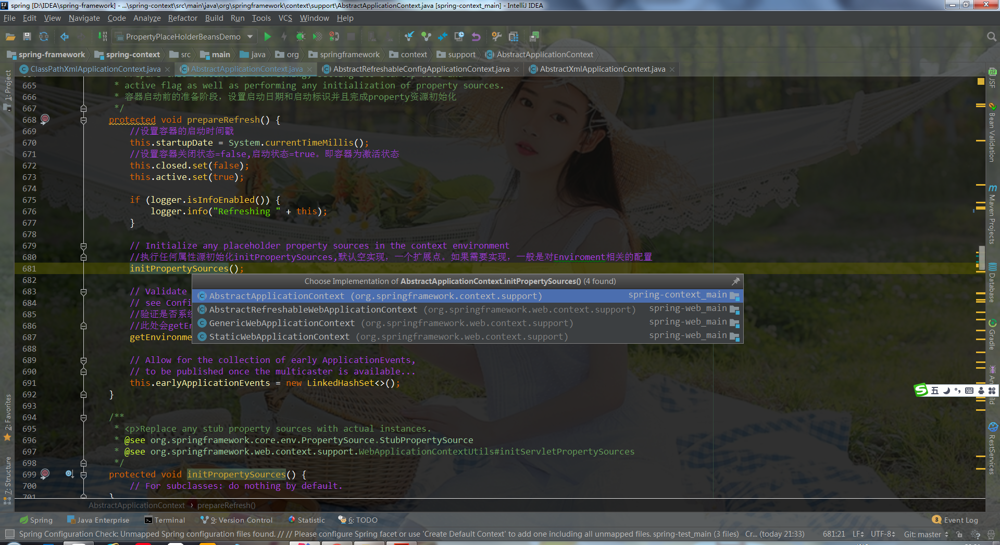
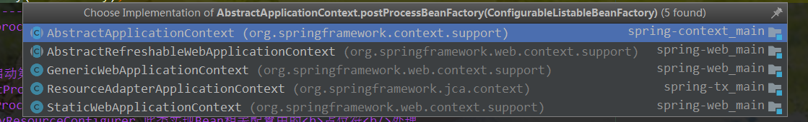

# Spring ApplicationContext（应用上下文）

> 本文从生命周期和源码角度来描述应用上下文。并且以`ClassPathXmlApplicationContext`示例。具体入口其父类了`AbstractApplicationContext#refresh()`方法。

# 整体源码

```java
/**
	 * roboslyq -- > 容器启动类
	 * @throws BeansException
	 * @throws IllegalStateException
	 */
	@Override
	public void refresh() throws BeansException, IllegalStateException {
		synchronized (this.startupShutdownMonitor) {
			// Prepare this context for refreshing.
			/* roboslyq--> 容器启动第一步：准备阶段：刷新前的预处理---(创建BeanFactory容器前环境准备)-->
			 *  (1)启动前准备操作（在父类AbstractRefreshableApplicationContext中实现）
			 *  (2)记录spring容器上下文的启动(刷新)时间和标记
			 *  (3)将容器激活状态active设为true，初始化一些容器启动必要的资源
			 *  (4)创建了Environment对象，即Spring体系的环境变量
			 */
			prepareRefresh();

			// Tell the subclass to refresh the internal bean factory.
			/*
			 * roboslyq-->容器启动第二步（十分重要核心！！！） ---(创建BeanFactory，并将资源文件转换为BeanDefinition存入容器中)-->
			 * （1）创建建Bean工厂，使用具体的子类去获取Bean工厂类，如果有则先销毁再创建。
			 * （2）完成Bean的定位，加载及注册整个过程，最终得到BeanDefinition
			 *  (3)英文单词解析
			 *  	obtain:获取，获得
			 *  	fresh:新的，新鲜的
			 *  	BeanFactory:Bean工厂
			 *  	obtainFreshBeanFactory:获取一个新的Bean工厂
			 *  默认的beanFactory类型为：DefaultListableBeanFactory
 			 */
			ConfigurableListableBeanFactory beanFactory = obtainFreshBeanFactory();

			// Prepare the bean factory for use in this context.
			//配置工厂的标准上下文特征
			/*	roboslyq-->容器启动第三步：BeanFactory的预准备工作（BeanFactory进行一些设置）
			 * ---(BeanFactory创建后，在创建具体Bean之前设置一些环境相关参数-->
			 * (1)容器启动第二步仅完成xml等资源文件到BeanDefinition的转换，还未开始初始化具体的SpringBean
			 * (2)在完成Bean资源文件加载及注册之后，为了可以使用使用IOC，进行Bean工厂初始化。
			 * (3)类装载器Classloader,PostProcessor等处理
			 */
			 prepareBeanFactory(beanFactory);

			try {
				// Allows post-processing of the bean factory in context subclasses.
				//roboslyq-->在BeanFactory完成初始化后进行一些操作，即在beanFactory初始化之后提供一个修改BeanFactory的机会
				//BeanFactory定义后，提供一个修改BeanFactory的入口。

				/*	roboslyq-->容器启动第四步：BeanFactory准备工作完成后进行的后置处理工作；
				 *  ---(BeanFactory创建后，提供一个修改BeanFactory默认行为的机会)-->
				 *	(1)模板抽象方法,当前未做处理。子类通过重写这个方法来在BeanFactory创建并预准备完成以后做进一步的设置
				 *	(2)	在第二步完成Bean容器(BeanFacotory)初始化后，此时BeanFacotry均是默认参数。
				 *		此入口提供目的是BeanDefinition装载后，可以再次修改BeanFactory的一些属性
				 *	(3)默认是空，没有实现，可以自定义扩展。具体扩展可以继承ClassPathXmlApplicationContext类
				 *  	并重写postProcessBeanFactory即可
				 */
				postProcessBeanFactory(beanFactory);
//--------------------------------------------以上方法是处理BeanFactory相关---------------------------------------------------------------------
				// Invoke factory processors registered as beans in the context.
				/*
				 * 占位符处理扩展
				 * roboslyq-->容器启动第五步 ---（提供一个修改BeanDefinition的入口）-->
				 *   (1)此功能与postProcessBeanFactory()方法有异曲同工之妙，需要实现BeanFactoryPostProcess的postProcessBeanFactory方法类似。
				 *   可以实现和postProcessBeanFactory()。
				 *   (2)例如PropertyResourceConfigurer,此类实现Bean相关配置中的<b>占位符<b/>处理。
				 *     就在这里调用PropertyResourceConfigurer相应实现完成。
				 *     BeanFactoryPostProcessor：BeanFactory的后置处理器。在BeanFactory标准初始化之后执行的；
				 * 	 (3)相关接口定义：PropertyResourceConfigurer，BeanFactoryPostProcessor及其子接口BeanDefinitionRegistryPostProcessor等
				 *	 (4) 如果底层实现是AnnotationConfigApplicationContext，则会调用相关Processor进行@ComponentScan相关注解处理
				 */

				invokeBeanFactoryPostProcessors(beanFactory);

				// Register bean processors that intercept bean creation.
				// 注册相关的实BeanPostProcessor，在AbstractBeanFactory中有一个BeanPostProcessor容器
				// private final List<BeanPostProcessor> beanPostProcessors = new ArrayList<>()
				// 这样在例化Bean的后置处理器，这样在Bean实例时，后置处理器就可以生效了。
				/*
				 * robosly-->容器启动第六步：注册BeanPostProcessor（Bean的后置处理器）
				 * --（注册用于拦截Bean创建的BeanPostProcessor）-->
				 * 	注册用于拦截Bean创建的BeanPostProcessor
				 * 	例如：AOP具体织和在这个入口完成，具体原因如下：
				 * 	(1) AOP在解析过程中会生成如下对象：
				 * 		被代理的目标对象
				 * 		定义的切面
				 * 		InternalAutoProxyCreator:用来生成代理对象的后置处理器，它实现了BeanPostProcessor，类型是AspectJAwareAdvisorAutoProxyCreator
				 * 		AspectJPointcutAdvisor#0:定义的通知
				 * 		AspectJPointcutAdvisor#1:定义的通知
				 * 		updateUserMethod:切入点表达式
				 *  （2）其中InternalAutoProxyCreator实现了BeanPostProcessor，所以会进入此方法处理
				 */
				registerBeanPostProcessors(beanFactory);
				// Initialize message source for this context.
				//roboslyq-->初始化MessageSource（国际化资源处理，消息绑定，消息解析）；
				initMessageSource();
				// Initialize event multicaster for this context.
				// roboslyq-->初始化应用事件广播器(观察者模式得典型应用)。
				// 我们知道观察者模式由主题Subject和Observer组成。广播器相当于主题Subject，其包含多个监听器。
				// 当主题发生变化时会通知所有得监听器，此时只是完成广播初始化，还未绑定具体广播的监听器。
				// 在下面的registerListeners()方法中完成监听器与广播绑定
				initApplicationEventMulticaster();

				// Initialize other special beans in specific context subclasses.
				//特定的上下文中初始化特别的beans,默认空实现。由子类自己实现重写，在容器刷新的时候可以自定义逻辑；
				onRefresh();
				// Check for listener beans and register them.
				//roboslyq-->注册监听器（给容器中将所有项目里面的ApplicationListener注册进来）
				//注册监听器，与广播器是同时存在的。在广播器章节，spring只是初始化的广播器，
				// 但是并没有为广播器绑定Listener, Spring在此方法中进行了绑定。
				registerListeners();
				// Instantiate all remaining (non-lazy-init) singletons.
				/*
				 * roboslyq-->初始化所有剩下的单实例bean，即将属性为no-lazy的BeanDefinition进行初始化,
				 * 最终得到Spring中可以使用的Bean（AOP织入也是在此阶段完成）。
				 */
				finishBeanFactoryInitialization(beanFactory);
				// Last step: publish corresponding event.
				//容器结束启动,表明已经完成BeanFactory的初始化创建工作及IOC容器就创建；
				finishRefresh();
			}
			catch (BeansException ex) {
				if (logger.isWarnEnabled()) {
					logger.warn("Exception encountered during context initialization - " +
							"cancelling refresh attempt: " + ex);
				}
				// Destroy already created singletons to avoid dangling resources.
				destroyBeans();
				// Reset 'active' flag.
				cancelRefresh(ex);
				// Propagate exception to caller.
				throw ex;
			}
			finally {
				// Reset common introspection caches in Spring's core, since we
				// might not ever need metadata for singleton beans anymore...
				resetCommonCaches();
			}
		}
	}

```


## 1、准备阶段->prepareRefresh()

```java
protected void prepareRefresh() {
		//准备工作1：设置容器的启动时间戳
		this.startupDate = System.currentTimeMillis();
		//准备工作2： 设置容器关闭状态=false,启动状态=true。即容器为激活状态
		this.closed.set(false);
		this.active.set(true);
    
		// Initialize any placeholder property sources in the context environment
		// 准备工作3：执行任何属性源初始化initPropertySources,默认空实现，一个扩展点。如果需要实现，一般是对Enviroment相关的配置
    	// 例如常见实现有
		initPropertySources();

		// Validate that all properties marked as required are resolvable
		// see ConfigurablePropertyResolver#setRequiredProperties
		//验证是否系统环境中有RequiredProperties参数值,默认空实现，一个扩展点
		//准备工作4：此处会getEnvironment,如果没有初始化，则新初始化一个。如果已经初始化则直接获取。通常WebContext已经在上面的initPropertySources()方法完成初始化。
		getEnvironment().validateRequir准备工作2：edProperties();

		// Allow for the collection of early ApplicationEvents,
		// to be published once the multicaster is available...
		this.earlyApplicationEvents = new LinkedHashSet<>();
	}

```


### initPropertiSources扩展实现

从下图我们可以看到，基本的扩展实现有4个，都是和具体的Web相关，我们以GenericWebApplicationContext为例进行解读：




`GenericWebApplicationContext#initPropertySources`

```java
	/**
	 * {@inheritDoc}
	 * <p>Replace {@code Servlet}-related property sources.
	 */
	@Override
	protected void initPropertySources() {
		ConfigurableEnvironment env = getEnvironment();
		if (env instanceof ConfigurableWebEnvironment) {
			((ConfigurableWebEnvironment) env).initPropertySources(this.servletContext, null);
		}
	}
	@Override
	public ConfigurableEnvironment getEnvironment() {
		if (this.environment == null) {
			this.environment = createEnvironment();
		}
		return this.environment;
	}

	/**
	 * Create and return a new {@link StandardEnvironment}.
	 * <p>Subclasses may override this method in order to supply
	 * a custom {@link ConfigurableEnvironment} implementation.
	 */
	@Override
	protected ConfigurableEnvironment createEnvironment() {
		return new StandardServletEnvironment();
	}

```

从上面源码可以看出，此时的Enviroment已经完成实例化了。相当于在扩展`initPropertySources()`方法时就已经提前实例化了Environment对象。

并且对Enviroment进行了扩展实现，添加了Servlet相关属性。

```java
public class StandardServletEnvironment extends StandardEnvironment implements ConfigurableWebEnvironment {

	public static final String SERVLET_CONTEXT_PROPERTY_SOURCE_NAME = "servletContextInitParams";

	public static final String SERVLET_CONFIG_PROPERTY_SOURCE_NAME = "servletConfigInitParams";

	public static final String JNDI_PROPERTY_SOURCE_NAME = "jndiProperties";

	@Override
	protected void customizePropertySources(MutablePropertySources propertySources) {
		propertySources.addLast(new StubPropertySource(SERVLET_CONFIG_PROPERTY_SOURCE_NAME));
		propertySources.addLast(new StubPropertySource(SERVLET_CONTEXT_PROPERTY_SOURCE_NAME));
		if (JndiLocatorDelegate.isDefaultJndiEnvironmentAvailable()) {
			propertySources.addLast(new JndiPropertySource(JNDI_PROPERTY_SOURCE_NAME));
		}
		super.customizePropertySources(propertySources);
	}

	@Override
	public void initPropertySources(@Nullable ServletContext servletContext, @Nullable ServletConfig servletConfig) {
		WebApplicationContextUtils.initServletPropertySources(getPropertySources(), servletContext, servletConfig);
	}

}
```


## 2、BeanFactory创建阶段-> obtainFreshBeanFactory();

AbstractApplicationContext#obtainFreshBeanFactory()

```java
protected ConfigurableListableBeanFactory obtainFreshBeanFactory() {
		/*
		 * roboslyq-刷新Bean工厂。在子类AbstractRefreshableApplicationContext类中有具体实现
		 * 此时，已经实现了BeanDefinition的装载。
		 * 十分重要的入口！！！
		 */
		refreshBeanFactory();
		/*
		 * roboslyq-获取Bean工厂,在子类AbstractRefreshableApplicationContext类中有具体实现。
		 */
		ConfigurableListableBeanFactory beanFactory = getBeanFactory();
		if (logger.isDebugEnabled()) {
			logger.debug("Bean factory for " + getDisplayName() + ": " + beanFactory);
		}
		return beanFactory;
	}

/**
	 * This implementation performs an actual refresh of this context's underlying
	 * bean factory, shutting down the previous bean factory (if any) and
	 * initializing a fresh bean factory for the next phase of the context's lifecycle.
	 * roboslyq--容器启动时刷新工厂。如果已经存在则先销毁关闭，然后重新创建新工厂。并且实现BeanDefinition的装载
	 */
	@Override
	protected final void refreshBeanFactory() throws BeansException {
		/**
		 * roboslyq-->Bean工厂是否存在。正常一般情况为false
		 */
		if (hasBeanFactory()) {
			destroyBeans();//销毁
			closeBeanFactory();//关闭
		}
		try {
			//roboslyq-->创建Bean工厂,直接new 一个 DefaultListableBeanFactory类进行干活
			//spring注册及加载bean就靠它。其实这里还是一个基本的容器
			DefaultListableBeanFactory beanFactory = createBeanFactory();
			//设置Bean工厂序列化ID
			beanFactory.setSerializationId(getId());
			//可对Bean工厂进行定制，一个扩展点
			customizeBeanFactory(beanFactory);
			/**
			 * 	roboslyq-->初始化XmlBeanDefinitionReader用来读取xml，并加载解析。装载BeanDefinition核心入口。
			 * 	在AbstractXmlApplicationContext中有具体实现
			 */
			loadBeanDefinitions(beanFactory);
			//设置为全局变量，AbstractRefreshableApplicationContext持有DefaultListableBeanFactory引用
			synchronized (this.beanFactoryMonitor) {
				this.beanFactory = beanFactory;
			}
		}
		catch (IOException ex) {
			throw new ApplicationContextException("I/O error parsing bean definition source for " + getDisplayName(), ex);
		}
	}
	// 创建Bean工厂，所以默认干活是DefaultListableBeanFactory
	protected DefaultListableBeanFactory createBeanFactory() {
		return new DefaultListableBeanFactory(getInternalParentBeanFactory());
	}

```

-  刷新 Spring 应用上下文底层 BeanFactory - refreshBeanFactory()
  - 销毁或关闭 BeanFactory，如果已存在的话

- 创建 BeanFactory - createBeanFactory()
  - 返回DefaultListableBeanFactory（具体干活的类），此处可以看到ApplicationContext虽然继承了BeanFactory接口，但具体的干活是通过代理类`DefaultListableBeanFactory`实现的。
- 设置 BeanFactory Id
  - 一般没有具体含义，但在spring boot,spring cloud中，通常设置为具体业务含义的ID.
- 自定义配置->customizeBeanFactory(DefaultListableBeanFactory beanFactory) 
  - 设置“是否允许 BeanDefinition 重复定义” - customizeBeanFactory(DefaultListableBeanFactory)
  - 设置“是否允许循环引用（依赖）” - customizeBeanFactory(DefaultListableBeanFactory)
- 加载 BeanDefinition - loadBeanDefinitions(DefaultListableBeanFactory) 方法
- 关联新建 BeanFactory 到 Spring 应用上下文
- 返回 Spring 应用上下文底层 BeanFactory - getBeanFactory()

## 3、BeanFafctory准备阶段->prepareBeanFactory(beanFactory);

```java

	/**
	 * Configure the factory's standard context characteristics,
	 * such as the context's ClassLoader and post-processors.
	 * 配置factory的标准上下文相关属性，例如类加载器，post-processors,SPEL处理器，属性Property编辑器
	 * BeanPostProcessor等
	 * @param beanFactory the BeanFactory to configure
	 */
	protected void prepareBeanFactory(ConfigurableListableBeanFactory beanFactory) {
		// Tell the internal bean factory to use the context's class loader etc.
		//设置beanFactory的classLoader为当前context的classLoader
		beanFactory.setBeanClassLoader(getClassLoader());
		//设置beanFactory的表达式语言处理器，spring3增加了表达式语言的支持，默认可以使用#{bean.xxx}的形式来调用相关属性值。
		beanFactory.setBeanExpressionResolver(new StandardBeanExpressionResolver(beanFactory.getBeanClassLoader()));
		//添加属性编辑器，更准确应该是属性转换器，比如从String到Date类型的 转化
		beanFactory.addPropertyEditorRegistrar(new ResourceEditorRegistrar(this, getEnvironment()));

		// Configure the bean factory with context callbacks.
		//添加后置处理器<调用相关的xxxAware接口>
		beanFactory.addBeanPostProcessor(new ApplicationContextAwareProcessor(this));
		//忽略自动装配，前面已经看到过
		beanFactory.ignoreDependencyInterface(EnvironmentAware.class);
		beanFactory.ignoreDependencyInterface(EmbeddedValueResolverAware.class);
		beanFactory.ignoreDependencyInterface(ResourceLoaderAware.class);
		beanFactory.ignoreDependencyInterface(ApplicationEventPublisherAware.class);
		beanFactory.ignoreDependencyInterface(MessageSourceAware.class);
		beanFactory.ignoreDependencyInterface(ApplicationContextAware.class);

		// BeanFactory interface not registered as resolvable type in a plain factory.
		// MessageSource registered (and found for autowiring) as a bean.
		//设置几个自动装配规则，例如如果是BeanFactory则注入beanFactory

		beanFactory.registerResolvableDependency(BeanFactory.class, beanFactory);
		beanFactory.registerResolvableDependency(ResourceLoader.class, this);
		beanFactory.registerResolvableDependency(ApplicationEventPublisher.class, this);
		beanFactory.registerResolvableDependency(ApplicationContext.class, this);

		// Register early post-processor for detecting inner beans as ApplicationListeners.
		beanFactory.addBeanPostProcessor(new ApplicationListenerDetector(this));

		// Detect a LoadTimeWeaver and prepare for weaving, if found.
		// 如果包含LoadTimeWeaver，（AspectJ支持）
		if (beanFactory.containsBean(LOAD_TIME_WEAVER_BEAN_NAME)) {
			//添加后置处理器
			beanFactory.addBeanPostProcessor(new LoadTimeWeaverAwareProcessor(beanFactory));
			// Set a temporary ClassLoader for type matching.
			beanFactory.setTempClassLoader(new ContextTypeMatchClassLoader(beanFactory.getBeanClassLoader()));
		}

		// Register default environment beans.
		// 这里个属性都是系统属性，我们前面看到过，但是都是单独存在的并没有注入到容器中
		//这里把系统属性注入到容器中
		if (!beanFactory.containsLocalBean(ENVIRONMENT_BEAN_NAME)) {
			// 注入Enviroment到容器中，因此，通过依赖注入或者主动查找到的EnviromentBean是同一个。都是来自于ApplicationConext中
			beanFactory.registerSingleton(ENVIRONMENT_BEAN_NAME, getEnvironment());
		}
		if (!beanFactory.containsLocalBean(SYSTEM_PROPERTIES_BEAN_NAME)) {
			beanFactory.registerSingleton(SYSTEM_PROPERTIES_BEAN_NAME, getEnvironment().getSystemProperties());
		}
		if (!beanFactory.containsLocalBean(SYSTEM_ENVIRONMENT_BEAN_NAME)) {
			beanFactory.registerSingleton(SYSTEM_ENVIRONMENT_BEAN_NAME, getEnvironment().getSystemEnvironment());
		}
	}
```

- 关联 ClassLoader
-  设置 Bean 表达式处理器
- 添加 PropertyEditorRegistrar 实现 - ResourceEditorRegistrar
- 添加 Aware 回调接口 BeanPostProcessor 实现 - ApplicationContextAwareProcessor
- 忽略 Aware 回调接口作为依赖注入接口
-  注册 ResolvableDependency 对象 - BeanFactory、ResourceLoader、ApplicationEventPublisher 以及
  ApplicationContext
- 注册 ApplicationListenerDetector 对象
- 注册 LoadTimeWeaverAwareProcessor 对象
- 注册单例对象 - Environment、Java System Properties 以及 OS 环境变量

## 4、BeanFactory后置处理阶段->postProcessBeanFactory(beanFactory);

> 此处是一个扩展点，有以下几种实现
>
> 
>
> 现以AbstractRefreshableWebApplicationContext为例

```java
/**
	 * Register request/session scopes, a {@link ServletContextAwareProcessor}, etc.
	 */
	@Override
	protected void postProcessBeanFactory(ConfigurableListableBeanFactory beanFactory) {
		beanFactory.addBeanPostProcessor(new ServletContextAwareProcessor(this.servletContext, this.servletConfig));
		beanFactory.ignoreDependencyInterface(ServletContextAware.class);
		beanFactory.ignoreDependencyInterface(ServletConfigAware.class);

		WebApplicationContextUtils.registerWebApplicationScopes(beanFactory, this.servletContext);
		WebApplicationContextUtils.registerEnvironmentBeans(beanFactory, this.servletContext, this.servletConfig);
	}
```

-  AbstractApplicationContext#postProcessBeanFactory(ConfigurableListableBeanFactory beanFactory) 
  - 扩展接口，由子类实现，可以注入BeanPostProcessor
- AbstractApplicationContext#invokeBeanFactoryPostProcessors(ConfigurableListableBeanFactor
  y 方法
  - 调用 BeanFactoryPostProcessor 或 BeanDefinitionRegistry 后置处理方
  -  注册 LoadTimeWeaverAwareProcessor 对象

## 5、初始化内建Bean->MessageSource

> AbstractApplicationContext#initMessageSource() 方法

## 6、初始化内建Bean->ApplicationEventPublisher  

> AbstractApplicationContext#initApplicationEventMulticaster() 方法。 ApplicationEventPublisher 底层实现

## 7、应用上下文刷新->onRefresh();

应用上下文刷新阶段•AbstractApplicationContext#onRefresh() 方法

子类覆盖该方法

- org.springframework.web.context.support.AbstractRefreshableWebApplicationContext#onRefresh()
- org.springframework.web.context.support.GenericWebApplicationContext#onRefresh()
- org.springframework.boot.web.reactive.context.ReactiveWebServerApplicationContext#onRefresh()
- org.springframework.boot.web.servlet.context.ServletWebServerApplicationContext#onRefresh()
- org.springframework.web.context.support.StaticWebApplicationContext#onRefresh()

## 8、注册监听器->registerListeners();

> AbstractApplicationContext#registerListeners() 方法

```java
	/**
	 * Add beans that implement ApplicationListener as listeners.
	 * Doesn't affect other listeners, which can be added without being beans.
	 */
	protected void registerListeners() {
		// Register statically specified listeners first.
		// 和手动注册BeanPostProcess一样，可以自己通过set手动注册监听器
		for (ApplicationListener<?> listener : getApplicationListeners()) {
			//手动注册的监听器绑定到广播器
			getApplicationEventMulticaster().addApplicationListener(listener);
		}

		// Do not initialize FactoryBeans here: We need to leave all regular beans
		// uninitialized to let post-processors apply to them!
		//取到监听器的名称，设置到广播器
		String[] listenerBeanNames = getBeanNamesForType(ApplicationListener.class, true, false);
		for (String listenerBeanName : listenerBeanNames) {
			getApplicationEventMulticaster().addApplicationListenerBean(listenerBeanName);
		}

		// Publish early application events now that we finally have a multicaster...
		// 如果存在早期应用事件，发布
		Set<ApplicationEvent> earlyEventsToProcess = this.earlyApplicationEvents;
		this.earlyApplicationEvents = null;
		if (earlyEventsToProcess != null) {
			for (ApplicationEvent earlyEvent : earlyEventsToProcess) {
				getApplicationEventMulticaster().multicastEvent(earlyEvent);
			}
		}
	}
```


- 添加当前应用上下文所关联的 ApplicationListener 对象（集合）
- 添加 BeanFactory 所注册 ApplicationListener Beans
- 广播早期 Spring 事件

## 9、初始化完成

AbstractApplicationContext#finishBeanFactoryInitialization(ConfigurableListableBeanFactory) 方法

- BeanFactory 关联 ConversionService Bean，如果存在
- 添加 StringValueResolver 对象
- 依赖查找 LoadTimeWeaverAware Bean
- BeanFactory 临时 ClassLoader 置为 null
- BeanFactory 冻结配置
- **BeanFactory 初始化非延迟单例 Beans**

## 10、应用上下刷新完成阶段->AbstractApplicationContext#finishRefresh()

>  AbstractApplicationContext#finishRefresh() 方法

- 清除 ResourceLoader 缓存 - clearResourceCaches() @since 5.0
- 初始化 LifecycleProcessor 对象 - initLifecycleProcessor()
- 调用 LifecycleProcessor#onRefresh() 方法
- 发布 Spring 应用上下文已刷新事件 - ContextRefreshedEvent
- 向 MBeanServer 托管 Live Beans

## 11、应用上下文启动阶段

AbstractApplicationContext#start() 方法

- 启动LifecycleProcessor
  - 依赖查找 Lifecycle Beans
  - 启动Lifecycle Beans
- 发布 Spring 应用上下文已停止事件 - ContextStartedEvent

## 12、Spring 应用上下文停止阶段

- AbstractApplicationContext#stop() 方法
  - 停止 LifecycleProcessor
    - 依赖查找 Lifecycle Beans
    - 停止 Lifecycle Beans
  - 发布 Spring 应用上下文已停止事件 - ContextStoppedEvent

## 13、Spring 应用上下文关闭阶段

- AbstractApplicationContext#close() 方法
  - 状态标识：active(false)、closed(true)
  - Live Beans JMX 撤销托管
    - LiveBeansView.unregisterApplicationContext(ConfigurableApplicationContext)
  - 发布 Spring 应用上下文已关闭事件 - ContextClosedEvent
  - 关闭 LifecycleProcessor
    -   依赖查找 Lifecycle Beans
    - 停止 Lifecycle Beans
  - 销毁 Spring Beans
  - 关闭 BeanFactory
  - 回调 onClose()
  - 注册 Shutdown Hook 线程（如果曾注册）