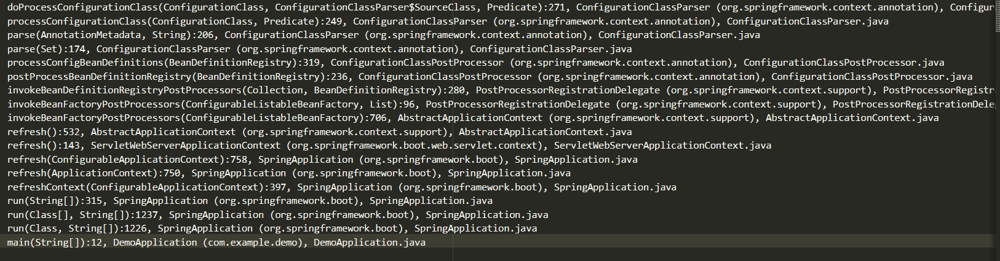

1、spring boot是通过ConfigurationClassPostProcessor这个BeanFactoryPostProcessor类来处理。
2、AnnotationConfigApplicationContext入口类
3、ConfigurationClassPostProcessor

https://blog.csdn.net/mapleleafforest/article/details/86623578

# Spring 版本

AnnotationConfigApplicationContext#AnnotationConfigApplicationContext(String... basePackages)->

AnnotationConfigApplicationContext#scan(String... basePackages)->

ClassPathBeanDefinitionScanner#scan(String... basePackages) ->

ClassPathScanningCandidateComponentProvider#findCandidateComponents(String basePackage)->

ClassPathScanningCandidateComponentProvider#scanCandidateComponents(String basePackage)

# Spring Boot版本

AnnotationConfigServletWebServerApplicationContext#refresh()->

**ServletWebServerApplicationContext#refresh() **->

AbstractApplicationContext#refresh()->

AbstractApplicationContext#invokeBeanFactoryPostProcessors(beanFactory)

**AbstractApplicationContext#invokeBeanFactoryPostProcessors**

**PostProcessorRegistrationDelegate#invokeBeanFactoryPostProcessors**

**ConfigurationClassPostProcessor#processConfigBeanDefinitions(BeanDefinitionRegistry):**

**ConfigurationClassParser#doProcessConfigurationClass**

**ClassPathBeanDefinitionScanner#scan**(String... basePackages) ->

ClassPathScanningCandidateComponentProvider#findCandidateComponents(String basePackage)->

ClassPathScanningCandidateComponentProvider#scanCandidateComponents(String basePackage)

#　栈信息

doProcessConfigurationClass(ConfigurationClass, ConfigurationClassParser$SourceClass, Predicate):271, ConfigurationClassParser (org.springframework.context.annotation), ConfigurationClassParser.java
processConfigurationClass(ConfigurationClass, Predicate):249, ConfigurationClassParser (org.springframework.context.annotation), ConfigurationClassParser.java
parse(AnnotationMetadata, String):206, ConfigurationClassParser (org.springframework.context.annotation), ConfigurationClassParser.java
parse(Set):174, ConfigurationClassParser (org.springframework.context.annotation), ConfigurationClassParser.java
processConfigBeanDefinitions(BeanDefinitionRegistry):319, ConfigurationClassPostProcessor (org.springframework.context.annotation), ConfigurationClassPostProcessor.java
postProcessBeanDefinitionRegistry(BeanDefinitionRegistry):236, ConfigurationClassPostProcessor (org.springframework.context.annotation), ConfigurationClassPostProcessor.java
invokeBeanDefinitionRegistryPostProcessors(Collection, BeanDefinitionRegistry):280, PostProcessorRegistrationDelegate (org.springframework.context.support), PostProcessorRegistrationDelegate.java
invokeBeanFactoryPostProcessors(ConfigurableListableBeanFactory, List):96, PostProcessorRegistrationDelegate (org.springframework.context.support), PostProcessorRegistrationDelegate.java
invokeBeanFactoryPostProcessors(ConfigurableListableBeanFactory):706, AbstractApplicationContext (org.springframework.context.support), AbstractApplicationContext.java
refresh():532, AbstractApplicationContext (org.springframework.context.support), AbstractApplicationContext.java
refresh():143, ServletWebServerApplicationContext (org.springframework.boot.web.servlet.context), ServletWebServerApplicationContext.java
refresh(ConfigurableApplicationContext):758, SpringApplication (org.springframework.boot), SpringApplication.java
refresh(ApplicationContext):750, SpringApplication (org.springframework.boot), SpringApplication.java
refreshContext(ConfigurableApplicationContext):397, SpringApplication (org.springframework.boot), SpringApplication.java
run(String[]):315, SpringApplication (org.springframework.boot), SpringApplication.java
run(Class[], String[]):1237, SpringApplication (org.springframework.boot), SpringApplication.java
run(Class, String[]):1226, SpringApplication (org.springframework.boot), SpringApplication.java
main(String[]):12, DemoApplication (com.example.demo), DemoApplication.java

