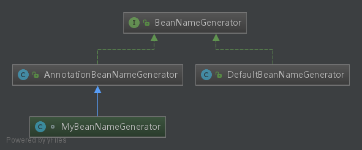

# Spring之Bean分析

# BeanDefinition

| Property                 | Explained in…                                                |                                               |
| :----------------------- | :----------------------------------------------------------- | --------------------------------------------- |
| Class                    | [Instantiating Beans](https://docs.spring.io/spring-framework/docs/5.1.18.RELEASE/spring-framework-reference/core.html#beans-factory-class) | Bean 全类名，必须是具体类，不能用抽象类或接口 |
| Name                     | [Naming Beans](https://docs.spring.io/spring-framework/docs/5.1.18.RELEASE/spring-framework-reference/core.html#beans-beanname) | Bean 的名称或者 ID                            |
| Scope                    | [Bean Scopes](https://docs.spring.io/spring-framework/docs/5.1.18.RELEASE/spring-framework-reference/core.html#beans-factory-scopes) | Bean 的作用域（如：singleton、prototype 等）  |
| Constructor arguments    | [Dependency Injection](https://docs.spring.io/spring-framework/docs/5.1.18.RELEASE/spring-framework-reference/core.html#beans-factory-collaborators) | Bean 构造器参数（用于依赖注入）               |
| Properties               | [Dependency Injection](https://docs.spring.io/spring-framework/docs/5.1.18.RELEASE/spring-framework-reference/core.html#beans-factory-collaborators) | Bean 属性设置（用于依赖注入）                 |
| Autowiring mode          | [Autowiring Collaborators](https://docs.spring.io/spring-framework/docs/5.1.18.RELEASE/spring-framework-reference/core.html#beans-factory-autowire) | Bean 自动绑定模式（如：通过名称 byName）      |
| Lazy initialization mode | [Lazy-initialized Beans](https://docs.spring.io/spring-framework/docs/5.1.18.RELEASE/spring-framework-reference/core.html#beans-factory-lazy-init) | Bean 延迟初始化模式（延迟和非延迟）           |
| Initialization method    | [Initialization Callbacks](https://docs.spring.io/spring-framework/docs/5.1.18.RELEASE/spring-framework-reference/core.html#beans-factory-lifecycle-initializingbean) | Bean 初始化回调方法名称                       |
| Destruction method       | [Destruction Callbacks](https://docs.spring.io/spring-framework/docs/5.1.18.RELEASE/spring-framework-reference/core.html#beans-factory-lifecycle-disposablebean) | Bean 销毁回调方法名称                         |

# Bean名称(Naming Beans)

- BeanNameGenerator

Bean别名

# Bean初始化方式

## Constructor

> [Instantiation with a Constructor](https://docs.spring.io/spring-framework/docs/5.1.18.RELEASE/spring-framework-reference/core.html#beans-factory-class-ctor)

## Static method factory

> [Instantiation with a Static Factory Method](https://docs.spring.io/spring-framework/docs/5.1.18.RELEASE/spring-framework-reference/core.html#beans-factory-class-static-factory-method)

## Instance factory

> [Instantiation by Using an Instance Factory Method](https://docs.spring.io/spring-framework/docs/5.1.18.RELEASE/spring-framework-reference/core.html#beans-factory-class-instance-factory-method)

# Bean依赖(Dependencies)

- Constructor-based Dependency Injection
- Setter-based Dependency Injection

# Bean作用域(Scopes)

# 自定义Bean属性

- [Lifecycle Callbacks](https://docs.spring.io/spring-framework/docs/5.1.18.RELEASE/spring-framework-reference/core.html#beans-factory-lifecycle)
- [`ApplicationContextAware` and `BeanNameAware`](https://docs.spring.io/spring-framework/docs/5.1.18.RELEASE/spring-framework-reference/core.html#beans-factory-aware)
- [Other `Aware` Interfaces](https://docs.spring.io/spring-framework/docs/5.1.18.RELEASE/spring-framework-reference/core.html#aware-list)

# BeanDefinition继承

# Bean生命周期

## 1)-BeanDefinition阶段

### 元信息配置

> XML配置
>
> Properties配置
>
> Anntation注解配置
>
> 使用BeanDefinition来保存元信息

### 元信息解析

### BeanDefinition注册阶段

将BeanDefinition注册到BeanFactory中

### BeanDefinition合并阶段

> Bean有Parent关系，当前Bean需要将Parent Bean相关属性和配置进行合并。在Java中，可以通过继承来实现，但在Bean配置中，仅是元信息，没有继续，需要一种合并的过程。

## 

## 2)-Bean阶段

### 2-1)-加载Bean

> 根据BeanDefinition中beanClassName的信息，将Class加载到JVM中

### 2-2)-实例化Bean

> 将Bean的Class实例为一个具体的对象

#### 实例化前

#### 实例化

#### 实例化后

BeanPostProcessor

### 2-3)-初始化Bean

#### 初始化化前

#### 初始化

#### 初始化后

BeanPostProcessor

### 2-4)-初始化完成

## 3)-使用

## 4)-销毁

## 生命周期中的扩展点

